# AI Agent Architecture Design

**Document Version:** 1.0  
**Date:** 2026-06-24  
**Project:** Saven InfraOps Command Center  
**Status:** ARCHITECTURE DESIGN (No Implementation)  
**Classification:** Enterprise ITSM Platform

---

## Table of Contents

1. [Executive Summary](#1-executive-summary)
2. [Current Architecture](#2-current-architecture)
3. [Proposed Architecture](#3-proposed-architecture)
4. [Mermaid Diagrams](#4-mermaid-diagrams)
5. [Tool Registry](#5-tool-registry)
6. [Intent Classification](#6-intent-classification)
7. [Multi-Tool Orchestration](#7-multi-tool-orchestration)
8. [Permission Handling](#8-permission-handling)
9. [Conversation Memory](#9-conversation-memory)
10. [Navigation Response Format](#10-navigation-response-format)
11. [Database Tool Response Format](#11-database-tool-response-format)
12. [Response Synthesizer](#12-response-synthesizer)
13. [Future Expansion](#13-future-expansion)
14. [Folder Structure](#14-folder-structure)
15. [Implementation Phases](#15-implementation-phases)
16. [Risks](#16-risks)
17. [Best Practices](#17-best-practices)
18. [Final Recommendations](#18-final-recommendations)

---

## 1. Executive Summary

### 1.1 Purpose

This document defines the architecture for replacing the current keyword-matching AI system with an Enterprise AI Agent architecture in the Saven InfraOps Command Center.

### 1.2 Problem Statement

The current implementation uses simple keyword matching to route requests to database queries or LLM fallback. This approach fails for:
- Questions requiring intent understanding
- Cross-entity queries
- Personalized queries ("assigned to me")
- Navigation commands
- Multi-step reasoning

### 1.3 Solution

An AI Agent architecture where:
1. **Intent Classifier** determines user intent
2. **Tool Registry** provides action capabilities
3. **Agent Orchestrator** coordinates execution
4. **Conversation Memory** maintains context
5. **Permission Guard** enforces access control

### 1.4 Target Capabilities

| Category | Description | Example |
|----------|-------------|---------|
| **Database Intelligence** | Query any entity with filters | "How many users are pending?" |
| **Application Navigation** | Navigate to any page | "Open the Incident page" |
| **General Knowledge** | Answer IT concepts | "What is ITIL?" |
| **Multi-Tool** | Combine capabilities | "Show incidents and navigate" |

### 1.5 Key Benefits

```
┌─────────────────────────────────────────────────────────────────────────┐
│                         ARCHITECTURE BENEFITS                             │
├─────────────────────────────────────────────────────────────────────────┤
│                                                                          │
│  Before                          After                                   │
│  ──────                          ─────                                   │
│  Keyword matching                Intent classification                    │
│  4 fixed routes                 15+ tools (extensible)                   │
│  No context                     Conversation memory                      │
│  Hardcoded navigation           Dynamic navigation                       │
│  No permissions                 RBAC integration                        │
│  Single query                   Multi-tool orchestration                  │
│                                                                          │
│  ┌────────────────────┐        ┌────────────────────────────┐            │
│  │ if (q.includes(...)) │ ──► │  Agent                    │            │
│  │   prisma.query()     │      │  ┌──────────────────┐     │            │
│  └────────────────────┘      │  │ Intent            │     │            │
│                              │  │ Classifier         │     │            │
│                              │  └─────────┬──────────┘     │            │
│                              │            │                 │            │
│                              │            ▼                 │            │
│                              │  ┌─────────────────────┐     │            │
│                              │  │ Tool Selector      │     │            │
│                              │  │ Permission Guard   │     │            │
│                              │  └─────────┬─────────┘     │            │
│                              │            │                 │            │
│                              │            ▼                 │            │
│                              │  ┌─────────────────────┐     │            │
│                              │  │ Tool Executor       │     │            │
│                              │  │ ┌───┐ ┌───┐ ┌───┐  │     │            │
│                              │  │ │ T │ │ T │ │ T │  │     │            │
│                              │  │ └───┘ └───┘ └───┘  │     │            │
│                              │  └─────────────────────┘     │            │
│                              └────────────────────────────┘            │
│                                                                          │
└─────────────────────────────────────────────────────────────────────────┘
```

---

## 2. Current Architecture

### 2.1 Request Flow

```
┌─────────────────────────────────────────────────────────────────────────┐
│                      CURRENT ARCHITECTURE                                  │
└─────────────────────────────────────────────────────────────────────────┘

   User Input
       │
       ▼
┌──────────────────┐
│  Frontend        │
│  AssistantPanel  │  POST /api/ai/ask
│  CommandBar      │  { question: "string" }
└────────┬─────────┘
         │
         ▼
┌──────────────────┐
│  ai.routes.ts    │  requireAuth + requirePermission('ai:ask')
└────────┬─────────┘
         │
         ▼
┌──────────────────┐
│  ai.service.ts   │
│  askAi()         │
│                  │
│  if (q.includes  │  ←── Keyword matching (4 routes)
│  ('service req')) │
│  else if (q.inc  │
│  ('incident'))    │
│  else if (q.inc  │
│  ('asset'))      │
│  else if (q.inc  │
│  ('compliance'))  │
│  else            │  ←── LLM fallback
└────────┬─────────┘
         │
    ┌────┴────┐
    │         │
    ▼         ▼
┌────────┐ ┌──────────┐
│Prisma  │ │ Provider │
│Query   │ │ Factory  │
└───┬────┘ └───┬──────┘
    │          │
    ▼          ▼
┌────────┐ ┌──────────┐
│ServiceR │ │ OpenAI   │
│equest   │ │ Gemini   │
│Incident │ │ Claude   │
│Asset    │ │ (LLMs)   │
│Complian │ └──────────┘
│ceControl│
└────────┘
```

### 2.2 Limitations

| Issue | Description |
|-------|-------------|
| **Fixed Routes** | Only 4 keyword routes + LLM fallback |
| **No Intent** | Cannot understand "pending users" → needs User query |
| **No Context** | Each question is independent |
| **Hardcoded Navigation** | Only 4 href links in cards |
| **No Permissions** | No permission-based tool filtering |
| **No Multi-Tool** | Cannot combine queries |
| **No Memory** | No conversation history |

### 2.3 Example Failures

| User Question | Current Behavior | Desired Behavior |
|--------------|------------------|------------------|
| "How many users exist?" | LLM fallback (no DB access) | `UserTool.count()` |
| "How many pending users?" | LLM fallback | `UserTool.find({ status: 'PENDING' })` |
| "Which vendor expires next month?" | LLM fallback | `VendorTool.find({ renewalAt: nextMonth })` |
| "Incidents assigned to me" | LLM fallback | `IncidentTool.find({ assigneeId: userId })` |
| "Navigate to Incidents" | CommandBar hardcoded | `NavigationTool.navigate('/incidents')` |
| "Show incidents and navigate" | Only one or the other | Execute both tools |

---

## 3. Proposed Architecture

### 3.1 High-Level Architecture

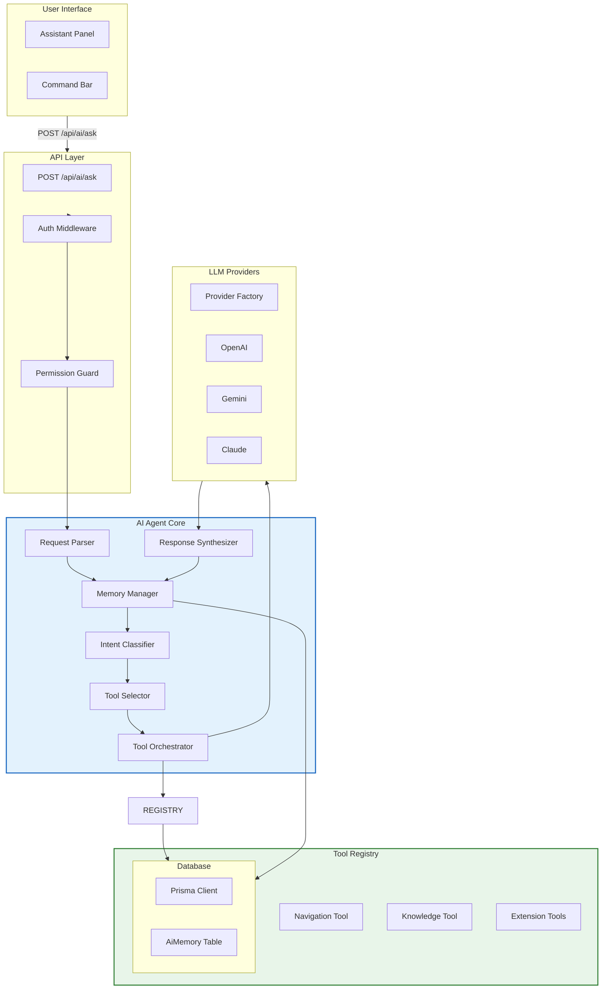

### 3.2 Component Overview

| Component | Responsibility | Key Interfaces |
|-----------|---------------|----------------|
| **Request Parser** | Validate and normalize input | `AgentRequest` |
| **Memory Manager** | Load/save conversation context | `ConversationContext` |
| **Intent Classifier** | Determine user intent | `IntentResult` |
| **Tool Selector** | Filter tools by intent & permissions | `Tool[]` |
| **Tool Orchestrator** | Execute tools in sequence/parallel | `ToolResult` |
| **Response Synthesizer** | Generate natural language response | `AgentResponse` |
| **Permission Guard** | Enforce RBAC on tool execution | `PermissionCheck` |

### 3.3 Data Flow

```
┌─────────────────────────────────────────────────────────────────────────┐
│                            DATA FLOW                                     │
└─────────────────────────────────────────────────────────────────────────┘

1. REQUEST
   User Input
   {
     "question": "How many pending incidents exist?",
     "conversationId": "conv-123"
   }

2. PARSE & VALIDATE
   └─→ Validate schema
   └─→ Extract entities (pending, incidents)

3. LOAD MEMORY
   └─→ Fetch conversation history
   └─→ Load user context & permissions

4. CLASSIFY INTENT
   └─→ Intent: DATABASE_QUERY
   └─→ Entities: [Incident]
   └─→ Parameters: { status: ['OPEN', 'IN_PROGRESS'] }

5. SELECT TOOLS
   └─→ Filter by permissions
   └─→ Selected: IncidentTool

6. EXECUTE TOOLS
   └─→ IncidentTool.execute({ status: ['OPEN', 'IN_PROGRESS'] })
   └─→ Returns: { count: 15, records: [...], cards: [...] }

7. SYNTHESIZE RESPONSE
   └─→ Build context with tool results
   └─→ Generate natural language
   └─→ "There are 15 open incidents."

8. SAVE MEMORY
   └─→ Store Q&A in AiMemory table
   └─→ Update conversation metadata

9. RESPONSE
   {
     "message": "There are 15 open incidents.",
     "cards": [...],
     "conversationId": "conv-123",
     "provider": "openai"
   }
```

---

## 4. Mermaid Diagrams

### 4.1 Complete System Architecture

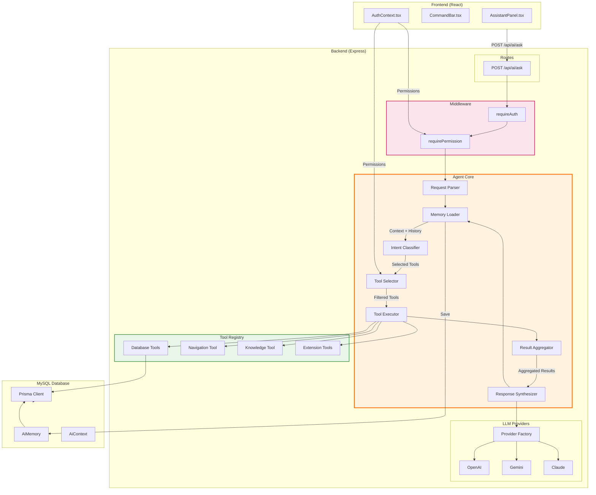

### 4.2 Intent Classification Flow

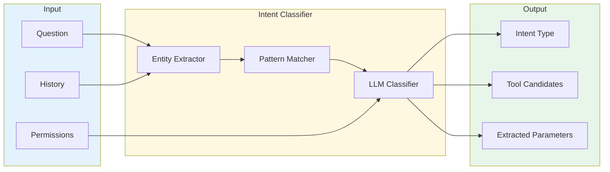

### 4.3 Tool Orchestration Sequence

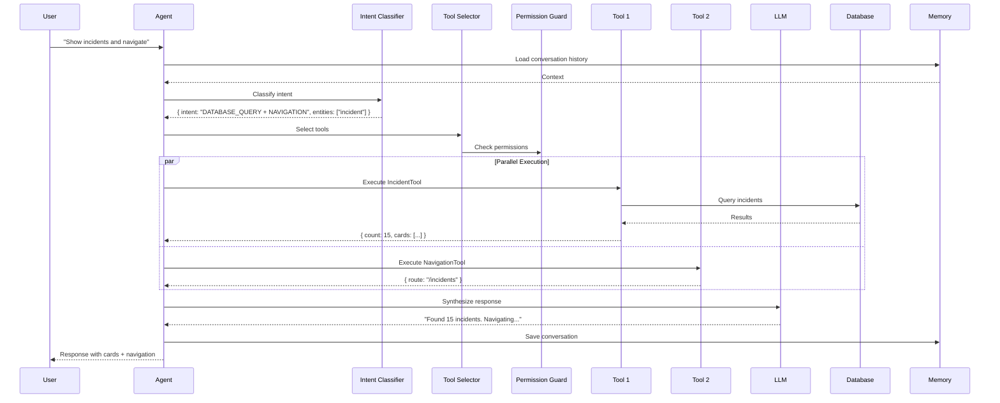

### 4.4 Permission Enforcement Flow

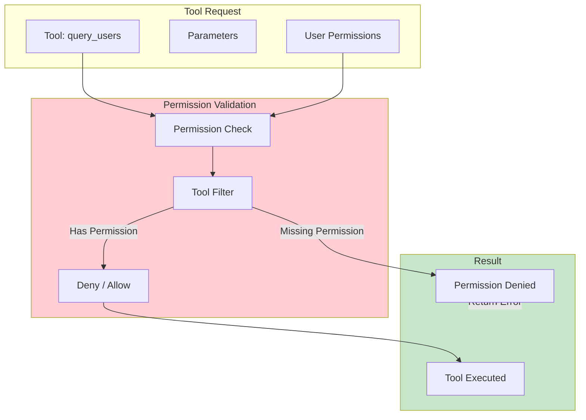

---

## 5. Tool Registry

### 5.1 Tool Interface

```typescript
interface Tool {
  name: string;
  description: string;
  category: 'database' | 'navigation' | 'knowledge' | 'system' | 'custom';
  requiredPermissions: string[];
  parameters: ToolParameters;
  execute: ToolExecutor;
}

interface ToolExecutor {
  (params: Record<string, unknown>, context: ToolContext): Promise<ToolResult>;
}

interface ToolContext {
  userId: string;
  userPermissions: string[];
  userRoles: string[];
  prisma: PrismaClient;
  conversationHistory?: Message[];
}

interface ToolResult {
  success: boolean;
  data?: unknown;
  count?: number;
  records?: Record<string, unknown>[];
  cards?: AiCard[];
  navigation?: NavigationAction;
  error?: string;
}
```

### 5.2 Database Tools

#### 5.2.1 UserTool

| Property | Value |
|----------|-------|
| **Name** | `query_users` |
| **Description** | Query user accounts, team members, and personnel information |
| **Category** | database |
| **Permissions** | `users:view` |
| **Prisma Model** | `User`, `UserRole`, `Role` |

**Methods:**

| Method | Parameters | Returns |
|--------|------------|---------|
| `count` | `filters` | `number` |
| `find` | `filters, pagination` | `User[]` |
| `findOne` | `id or email` | `User` |
| `byDepartment` | `department` | `User[]` |
| `byRole` | `roleId` | `User[]` |
| `pending` | - | `User[]` |
| `search` | `query` | `User[]` |

**Parameters:**

```typescript
{
  status?: string[],           // PENDING_ACTIVATION, ACTIVE, DISABLED, LOCKED
  department?: string,
  roleId?: string,
  search?: string,             // Search name/email
  includeRoles?: boolean,
  limit?: number,
  offset?: number
}
```

**Example:**
```
Input:  { status: ['PENDING_ACTIVATION'], limit: 10 }
Output: { count: 5, records: [...], cards: [...] }
```

---

#### 5.2.2 IncidentTool

| Property | Value |
|----------|-------|
| **Name** | `query_incidents` |
| **Description** | Query IT incidents, outages, and emergency issues |
| **Category** | database |
| **Permissions** | `incidents:view` |
| **Prisma Model** | `Incident` |

**Methods:**

| Method | Parameters | Returns |
|--------|------------|---------|
| `count` | `filters` | `number` |
| `find` | `filters, pagination` | `Incident[]` |
| `findOne` | `id or incidentNo` | `Incident` |
| `bySeverity` | `severity[]` | `Incident[]` |
| `byAssignee` | `assigneeName` | `Incident[]` |
| `byStatus` | `status[]` | `Incident[]` |
| `assignedToMe` | `userId` | `Incident[]` |
| `critical` | - | `Incident[]` |

**Parameters:**

```typescript
{
  status?: string[],           // OPEN, IN_PROGRESS, RESOLVED, CLOSED
  severity?: string[],         // SEV1, SEV2, SEV3, SEV4
  ownerName?: string,
  impactedService?: string,
  createdAfter?: Date,
  createdBefore?: Date,
  limit?: number,
  offset?: number
}
```

**Example:**
```
Input:  { status: ['OPEN'], severity: ['SEV1', 'SEV2'], limit: 10 }
Output: { count: 8, records: [...], cards: [...] }
```

---

#### 5.2.3 ServiceRequestTool

| Property | Value |
|----------|-------|
| **Name** | `query_tickets` |
| **Description** | Query service requests and tickets |
| **Category** | database |
| **Permissions** | `tickets:view` |
| **Prisma Model** | `ServiceRequest` |

**Methods:**

| Method | Parameters | Returns |
|--------|------------|---------|
| `count` | `filters` | `number` |
| `find` | `filters, pagination` | `ServiceRequest[]` |
| `findOne` | `id or ticketNo` | `ServiceRequest` |
| `byPriority` | `priority[]` | `ServiceRequest[]` |
| `byAssignee` | `assigneeId` | `ServiceRequest[]` |
| `byRequester` | `requesterId` | `ServiceRequest[]` |
| `assignedToMe` | `userId` | `ServiceRequest[]` |
| `breached` | - | `ServiceRequest[]` |
| `byCategory` | `category` | `ServiceRequest[]` |

**Parameters:**

```typescript
{
  status?: string[],
  priority?: string[],         // LOW, MEDIUM, HIGH, CRITICAL
  category?: string,
  assigneeId?: string,
  requesterId?: string,
  projectName?: string,
  includeBreached?: boolean,
  limit?: number,
  offset?: number
}
```

---

#### 5.2.4 AssetTool

| Property | Value |
|----------|-------|
| **Name** | `query_assets` |
| **Description** | Query IT inventory, equipment, and assets |
| **Category** | database |
| **Permissions** | `inventory:view` |
| **Prisma Model** | `Asset` |

**Methods:**

| Method | Parameters | Returns |
|--------|------------|---------|
| `count` | `filters` | `number` |
| `find` | `filters, pagination` | `Asset[]` |
| `findOne` | `id or assetNo` | `Asset` |
| `byStatus` | `status[]` | `Asset[]` |
| `byType` | `assetType` | `Asset[]` |
| `byLocation` | `location` | `Asset[]` |
| `available` | - | `Asset[]` |
| `assigned` | - | `Asset[]` |
| `expiringWarranty` | `withinDays` | `Asset[]` |

**Parameters:**

```typescript
{
  status?: string[],           // AVAILABLE, ASSIGNED, UNDER_REPAIR, DAMAGED, LOST, RETIRED
  assetType?: string,           // Laptop, Server, Monitor, etc.
  assignedToName?: string,
  location?: string,
  make?: string,
  model?: string,
  warrantyExpiringWithin?: number,
  limit?: number,
  offset?: number
}
```

---

#### 5.2.5 ComplianceTool

| Property | Value |
|----------|-------|
| **Name** | `query_compliance` |
| **Description** | Query compliance controls, audits, and regulatory items |
| **Category** | database |
| **Permissions** | `compliance:view` |
| **Prisma Model** | `ComplianceControl` |

**Methods:**

| Method | Parameters | Returns |
|--------|------------|---------|
| `count` | `filters` | `number` |
| `find` | `filters, pagination` | `ComplianceControl[]` |
| `findOne` | `id or controlNo` | `ComplianceControl` |
| `byStatus` | `status[]` | `ComplianceControl[]` |
| `byRiskRating` | `riskRating[]` | `ComplianceControl[]` |
| `byOwner` | `ownerName` | `ComplianceControl[]` |
| `byControlArea` | `controlArea` | `ComplianceControl[]` |
| `dueSoon` | `withinDays` | `ComplianceControl[]` |
| `overdue` | - | `ComplianceControl[]` |
| `dueThisMonth` | - | `ComplianceControl[]` |

**Parameters:**

```typescript
{
  status?: string[],
  riskRating?: string[],       // LOW, MEDIUM, HIGH, CRITICAL
  controlArea?: string,
  ownerName?: string,
  dueWithinDays?: number,
  overdue?: boolean,
  hasEvidence?: boolean,
  limit?: number,
  offset?: number
}
```

---

#### 5.2.6 VendorTool

| Property | Value |
|----------|-------|
| **Name** | `query_vendors` |
| **Description** | Query vendor information and licenses |
| **Category** | database |
| **Permissions** | `vendors:view` |
| **Prisma Model** | `VendorLicense` |

**Methods:**

| Method | Parameters | Returns |
|--------|------------|---------|
| `count` | `filters` | `number` |
| `find` | `filters, pagination` | `VendorLicense[]` |
| `findOne` | `id` | `VendorLicense` |
| `byVendor` | `vendorName` | `VendorLicense[]` |
| `expiringSoon` | `withinDays` | `VendorLicense[]` |
| `expiringThisMonth` | - | `VendorLicense[]` |
| `overCapacity` | - | `VendorLicense[]` |

**Parameters:**

```typescript
{
  vendorName?: string,
  licenseName?: string,
  expiringWithinDays?: number,
  overCapacity?: boolean,
  ownerName?: string,
  limit?: number,
  offset?: number
}
```

---

#### 5.2.7 ProjectTool

| Property | Value |
|----------|-------|
| **Name** | `query_projects` |
| **Description** | Query projects and environments |
| **Category** | database |
| **Permissions** | `projects:view` |
| **Prisma Model** | `ProjectEnvironment` |

**Methods:**

| Method | Parameters | Returns |
|--------|------------|---------|
| `count` | `filters` | `number` |
| `find` | `filters, pagination` | `ProjectEnvironment[]` |
| `findOne` | `id` | `ProjectEnvironment` |
| `byProject` | `projectName` | `ProjectEnvironment[]` |
| `byEnvironment` | `environmentName` | `ProjectEnvironment[]` |
| `byOwner` | `ownerName` | `ProjectEnvironment[]` |

**Parameters:**

```typescript
{
  projectName?: string,
  environmentName?: string,
  serviceName?: string,
  ownerName?: string,
  backupEnabled?: boolean,
  limit?: number,
  offset?: number
}
```

---

#### 5.2.8 AccessTool

| Property | Value |
|----------|-------|
| **Name** | `query_access_requests` |
| **Description** | Query access and identity provisioning requests |
| **Category** | database |
| **Permissions** | `access:view` |
| **Prisma Model** | `AccessRequest` |

**Methods:**

| Method | Parameters | Returns |
|--------|------------|---------|
| `count` | `filters` | `number` |
| `find` | `filters, pagination` | `AccessRequest[]` |
| `findOne` | `id` | `AccessRequest` |
| `byStatus` | `status[]` | `AccessRequest[]` |
| `pendingApproval` | - | `AccessRequest[]` |
| `byRequester` | `requesterName` | `AccessRequest[]` |
| `bySystem` | `systemName` | `AccessRequest[]` |
| `expiringSoon` | `withinDays` | `AccessRequest[]` |

**Parameters:**

```typescript
{
  status?: string[],           // REQUESTED, APPROVED, REJECTED, PROVISIONED, REVOKED
  requesterName?: string,
  systemName?: string,
  accessType?: string,
  pendingApproval?: boolean,
  approverName?: string,
  expiringWithinDays?: number,
  limit?: number,
  offset?: number
}
```

---

#### 5.2.9 ProblemTool

| Property | Value |
|----------|-------|
| **Name** | `query_problems` |
| **Description** | Query known problems and root cause analysis |
| **Category** | database |
| **Permissions** | `problems:view` |
| **Prisma Model** | `Problem` |

**Methods:**

| Method | Parameters | Returns |
|--------|------------|---------|
| `count` | `filters` | `number` |
| `find` | `filters, pagination` | `Problem[]` |
| `findOne` | `id` | `Problem` |
| `byStatus` | `status[]` | `Problem[]` |
| `byOwner` | `ownerName` | `Problem[]` |
| `open` | - | `Problem[]` |

---

#### 5.2.10 ChangeTool

| Property | Value |
|----------|-------|
| **Name** | `query_changes` |
| **Description** | Query change requests and approvals |
| **Category** | database |
| **Permissions** | `changes:view` |
| **Prisma Model** | `ChangeRequest` |

**Methods:**

| Method | Parameters | Returns |
|--------|------------|---------|
| `count` | `filters` | `number` |
| `find` | `filters, pagination` | `ChangeRequest[]` |
| `findOne` | `id` | `ChangeRequest` |
| `byStatus` | `status[]` | `ChangeRequest[]` |
| `byRiskLevel` | `riskLevel[]` | `ChangeRequest[]` |
| `pendingApproval` | - | `ChangeRequest[]` |
| `byOwner` | `ownerName` | `ChangeRequest[]` |
| `upcomingWindow` | - | `ChangeRequest[]` |

---

#### 5.2.11 KnowledgeTool

| Property | Value |
|----------|-------|
| **Name** | `query_knowledge` |
| **Description** | Query knowledge base articles |
| **Category** | database |
| **Permissions** | `kb:view` |
| **Prisma Model** | `KnowledgeBaseArticle` |

**Methods:**

| Method | Parameters | Returns |
|--------|------------|---------|
| `search` | `query` | `KnowledgeBaseArticle[]` |
| `find` | `filters` | `KnowledgeBaseArticle[]` |
| `findOne` | `id` | `KnowledgeBaseArticle` |
| `byCategory` | `category` | `KnowledgeBaseArticle[]` |
| `byStatus` | `status[]` | `KnowledgeBaseArticle[]` |
| `byAuthor` | `authorName` | `KnowledgeBaseArticle[]` |

---

#### 5.2.12 RoleTool

| Property | Value |
|----------|-------|
| **Name** | `query_roles` |
| **Description** | Query roles and their permissions |
| **Category** | database |
| **Permissions** | `roles:view` |
| **Prisma Model** | `Role`, `Permission`, `RolePermission` |

**Methods:**

| Method | Parameters | Returns |
|--------|------------|---------|
| `findAll` | - | `Role[]` |
| `findOne` | `roleId or name` | `Role` |
| `permissions` | `roleId` | `Permission[]` |
| `users` | `roleId` | `User[]` |

---

#### 5.2.13 AuditTool

| Property | Value |
|----------|-------|
| **Name** | `query_audit_logs` |
| **Description** | Query audit trail and change history |
| **Category** | database |
| **Permissions** | `audit:view` |
| **Prisma Model** | `AuditLog` |

**Methods:**

| Method | Parameters | Returns |
|--------|------------|---------|
| `find` | `filters` | `AuditLog[]` |
| `byActor` | `actorEmail` | `AuditLog[]` |
| `byEntity` | `entityType, entityId` | `AuditLog[]` |
| `byAction` | `action` | `AuditLog[]` |
| `recent` | `limit` | `AuditLog[]` |

---

### 5.3 Navigation Tool

#### 5.3.1 NavigationTool

| Property | Value |
|----------|-------|
| **Name** | `navigate_to` |
| **Description** | Generate navigation response to a specific page |
| **Category** | navigation |
| **Permissions** | None (all authenticated users) |

**Parameters:**

```typescript
{
  route: string,               // Required
  label?: string,             // Optional label
  context?: {
    filters?: Record<string, string>,
    selectedId?: string,
    tab?: string,
    modalAction?: 'create' | 'edit' | 'view'
  }
}
```

**Available Routes:**

| Route | Label | Description |
|-------|-------|-------------|
| `/` | Dashboard | Main dashboard |
| `/service-requests` | Service Requests | Ticket list |
| `/incidents` | Incidents | Incident list |
| `/problems` | Problems | Problem list |
| `/changes` | Changes | Change requests |
| `/inventory` | Inventory | Asset list |
| `/access-management` | Access | Access requests |
| `/compliance` | Compliance | Controls |
| `/projects-environments` | Projects | Environments |
| `/vendors-licenses` | Vendors | Licenses |
| `/reports-analytics` | Reports | Analytics |
| `/knowledge-base` | Knowledge | Articles |
| `/users-teams` | Users | User management |
| `/roles-permissions` | Roles | Role management |
| `/settings` | Settings | System settings |

**Output:**

```typescript
{
  success: true,
  navigation: {
    route: '/incidents',
    label: 'Incidents',
    description: 'IT incident management',
    context: {
      filters: { severity: 'SEV1' }
    }
  }
}
```

---

### 5.4 Knowledge Tool

#### 5.4.1 KnowledgeTool

| Property | Value |
|----------|-------|
| **Name** | `answer_knowledge` |
| **Description** | Answer general IT and ITSM questions using LLM |
| **Category** | knowledge |
| **Permissions** | None |

**Parameters:**

```typescript
{
  question: string,
  topics?: string[]           // Optional hints: ['ITIL', 'DevOps', 'Security']
}
```

---

### 5.5 Summary Table

| Tool | Category | Permission | Entity |
|------|----------|------------|--------|
| `query_users` | database | `users:view` | User |
| `query_incidents` | database | `incidents:view` | Incident |
| `query_tickets` | database | `tickets:view` | ServiceRequest |
| `query_assets` | database | `inventory:view` | Asset |
| `query_compliance` | database | `compliance:view` | ComplianceControl |
| `query_vendors` | database | `vendors:view` | VendorLicense |
| `query_projects` | database | `projects:view` | ProjectEnvironment |
| `query_access_requests` | database | `access:view` | AccessRequest |
| `query_problems` | database | `problems:view` | Problem |
| `query_changes` | database | `changes:view` | ChangeRequest |
| `query_knowledge` | database | `kb:view` | KnowledgeBaseArticle |
| `query_roles` | database | `roles:view` | Role, Permission |
| `query_audit_logs` | database | `audit:view` | AuditLog |
| `navigate_to` | navigation | None | - |
| `answer_knowledge` | knowledge | None | - |

---

## 6. Intent Classification

### 6.1 Intent Types

```typescript
enum IntentType {
  DATABASE_QUERY = 'DATABASE_QUERY',
  NAVIGATION = 'NAVIGATION',
  KNOWLEDGE = 'KNOWLEDGE',
  MIXED = 'MIXED',
  ACTION = 'ACTION',
  UNKNOWN = 'UNKNOWN'
}
```

### 6.2 Classification Flow

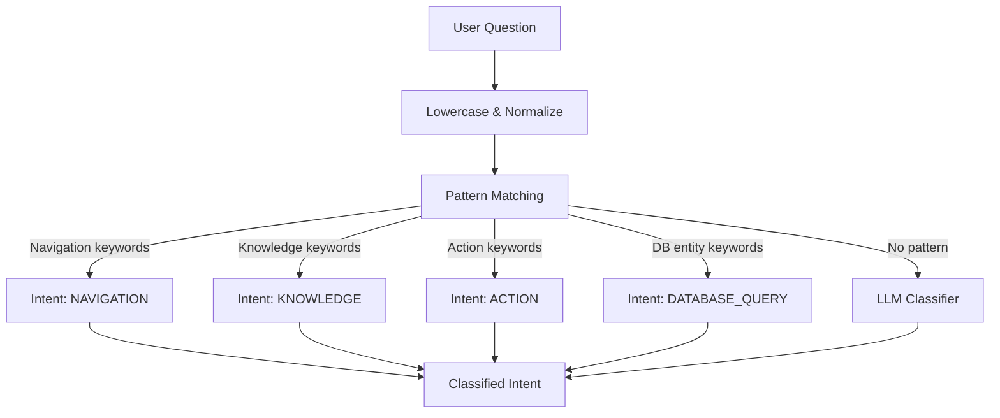

### 6.3 Pattern Rules

| Pattern | Intent | Example |
|---------|--------|---------|
| `navigate` or `go to` or `open` | NAVIGATION | "Open the dashboard" |
| `what is` or `explain` or `define` | KNOWLEDGE | "What is ITIL?" |
| `create` or `delete` or `update` | ACTION | "Create a new ticket" |
| `how many` or `show` or `list` | DATABASE_QUERY | "How many users?" |
| Multiple intents | MIXED | "Show incidents and navigate" |

### 6.4 Entity Keywords Mapping

| Entity | Keywords |
|--------|----------|
| User | `user`, `users`, `person`, `team member`, `employee`, `pending` |
| Incident | `incident`, `incidents`, `outage`, `emergency`, `downtime` |
| Ticket | `ticket`, `tickets`, `request`, `service request`, `sr-` |
| Asset | `asset`, `assets`, `inventory`, `laptop`, `equipment`, `hardware` |
| Compliance | `compliance`, `control`, `audit`, `regulation`, `risk` |
| Vendor | `vendor`, `license`, `contract`, `renewal` |
| Project | `project`, `environment`, `server`, `service` |
| Access | `access`, `provision`, `permission`, `identity` |
| Problem | `problem`, `rca`, `root cause` |
| Change | `change`, `change request`, `cr-` |

### 6.5 Context-Aware Resolution

```
Example: "How many pending?"

Step 1: Extract entity
        "pending" → needs context
        Check conversation history
        
Step 2: Look for previous entity
        History: "How many users exist?"
        → Entity resolved: User
        
Step 3: Apply filter
        Tool: query_users
        Parameters: { status: ['PENDING_ACTIVATION'] }
```

---

## 7. Multi-Tool Orchestration

### 7.1 Orchestration Modes

| Mode | Description | Example |
|------|-------------|---------|
| **Single** | Execute one tool | "How many users?" |
| **Parallel** | Execute multiple independent tools | "Users and incidents" |
| **Sequential** | Execute tools with dependencies | "Find user, then their tickets" |
| **Conditional** | Execute based on previous result | "If count > 0, navigate" |

### 7.2 Example: Mixed Intent

**User Question:** "Show all pending incidents and navigate to the incidents page"

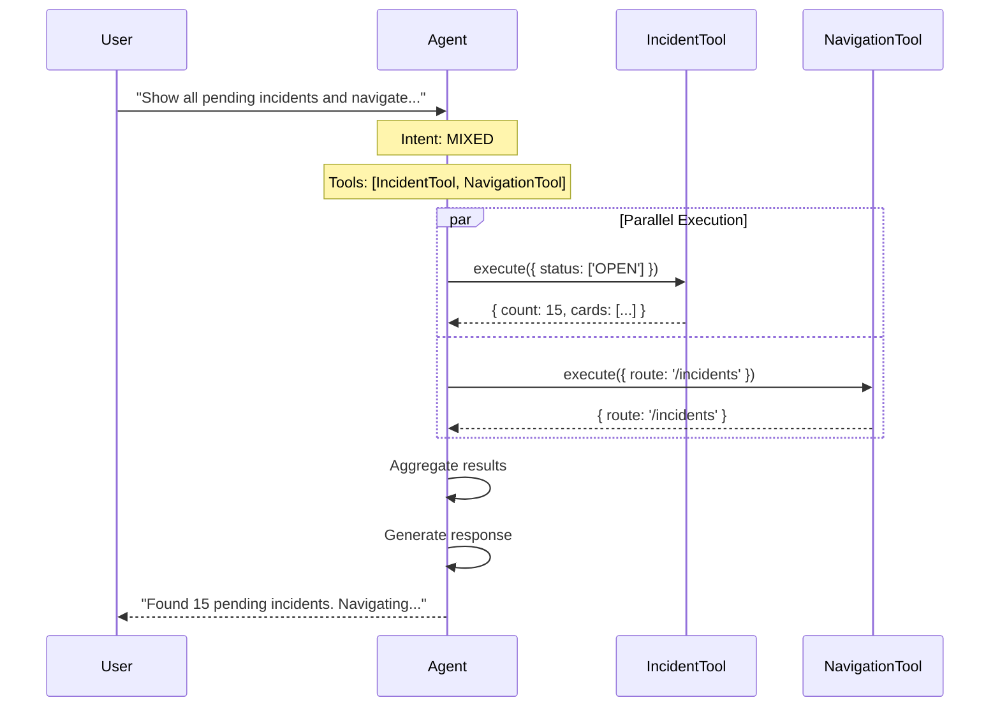

### 7.3 Example: Sequential with Dependency

**User Question:** "Show tickets from John and find related incidents"

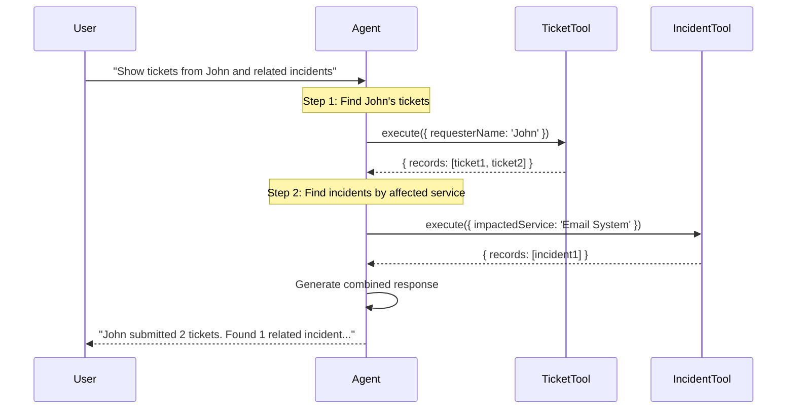

### 7.4 Tool Execution Graph

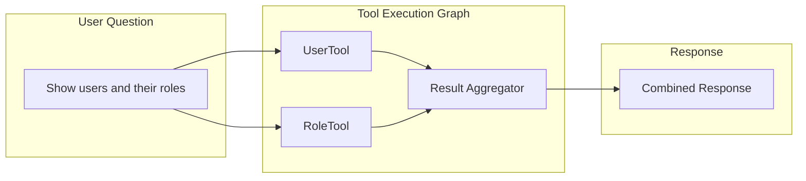

---

## 8. Permission Handling

### 8.1 Permission Model

```typescript
interface PermissionContext {
  userId: string;
  userPermissions: string[];
  userRoles: string[];
}

// Every tool declares required permissions
const IncidentTool: Tool = {
  name: 'query_incidents',
  requiredPermissions: ['incidents:view'],
  // ...
};
```

### 8.2 Permission Flow

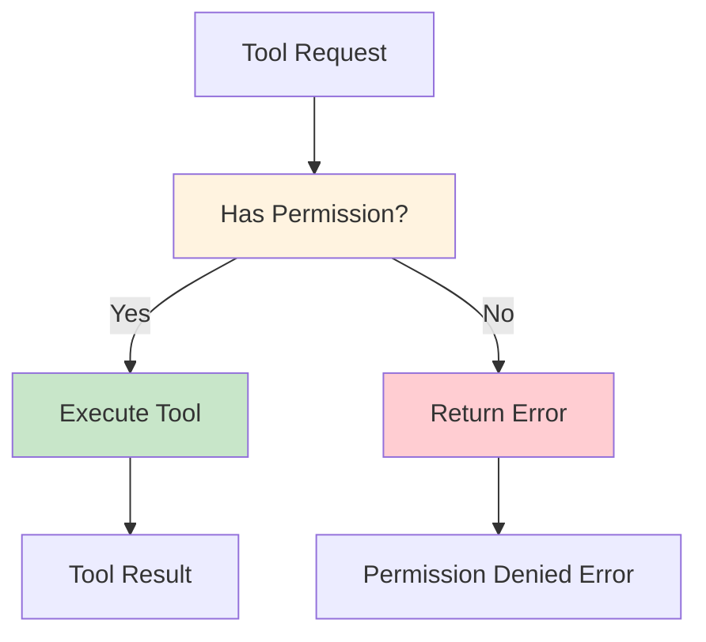

### 8.3 Permission Error Response

```typescript
{
  success: false,
  error: 'PERMISSION_DENIED',
  message: 'You do not have permission to access incidents.',
  requiredPermission: 'incidents:view',
  suggestion: 'Contact your administrator to request this permission.'
}
```

### 8.4 Tool Selection with Permissions

```typescript
async function selectTools(
  requestedTools: string[],
  allTools: Tool[],
  context: PermissionContext
): Promise<{ allowed: string[], denied: { tool: string, reason: string }[] }> {
  
  const allowed: string[] = [];
  const denied: { tool: string, reason: string }[] = [];
  
  for (const toolName of requestedTools) {
    const tool = allTools.find(t => t.name === toolName);
    
    if (!tool) {
      denied.push({ tool: toolName, reason: 'Tool not found' });
      continue;
    }
    
    const hasPermission = tool.requiredPermissions.every(
      perm => context.userPermissions.includes(perm)
    );
    
    if (hasPermission) {
      allowed.push(toolName);
    } else {
      denied.push({ 
        tool: toolName, 
        reason: `Missing: ${tool.requiredPermissions.join(', ')}` 
      });
    }
  }
  
  return { allowed, denied };
}
```

---

## 9. Conversation Memory

### 9.1 Memory Architecture

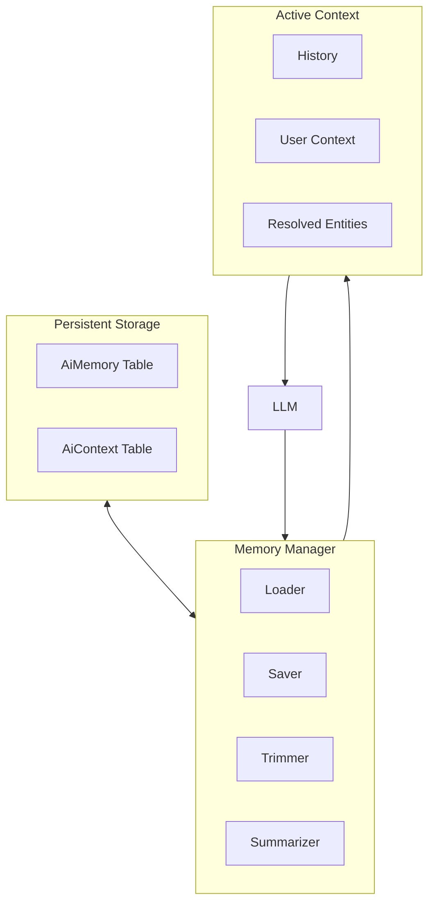

### 9.2 Database Schema

```prisma
model AiMemory {
  id             String   @id @default(cuid())
  conversationId String   @index
  userId         String   @index
  role           String   // 'user' | 'assistant' | 'tool'
  content        String   @db.Text
  toolName       String?
  toolInput      Json?
  toolOutput     Json?
  tokens         Int?
  createdAt      DateTime @default(now())
}

model AiContext {
  id             String   @id @default(cuid())
  conversationId String   @unique
  userId         String   @index
  title          String?
  messageCount   Int      @default(0)
  lastMessageAt  DateTime @default(now())
  metadata       Json?
  createdAt      DateTime @default(now())
  updatedAt      DateTime @updatedAt
}
```

### 9.3 Context Resolution Example

```
Conversation:
─────────────────────────────────────────────────────────────
User:     "How many users exist?"
Assistant: "There are 28 users."

User:     "How many are pending?"     ←─── "pending" resolves to "users"
Assistant: "5 users are pending."
─────────────────────────────────────────────────────────────

Resolution:
1. Extract entity from "pending"
2. Check conversation history
3. Find "users" mentioned
4. Apply pending filter to User entity
5. Execute query_users({ status: ['PENDING_ACTIVATION'] })
```

### 9.4 Context Loading

```typescript
async function loadContext(
  conversationId: string,
  maxMessages: number = 20
): Promise<ConversationContext> {
  
  // Load recent messages
  const messages = await prisma.aiMemory.findMany({
    where: { conversationId },
    orderBy: { createdAt: 'desc' },
    take: maxMessages
  });
  
  // Load user context
  const context = await prisma.aiContext.findUnique({
    where: { conversationId }
  });
  
  return {
    messages: messages.reverse(),
    userId: context?.userId,
    lastTopic: extractLastTopic(messages),
    resolvedEntities: extractResolvedEntities(messages)
  };
}
```

---

## 10. Navigation Response Format

### 10.1 Navigation Response Schema

```typescript
interface NavigationResponse {
  success: boolean;
  navigation: {
    type: 'route' | 'modal' | 'drawer' | 'action';
    route: string;
    label: string;
    description?: string;
    context?: {
      filters?: Record<string, string>;
      selectedId?: string;
      tab?: string;
      modalAction?: 'create' | 'edit' | 'view';
    };
  };
  message?: string;
}
```

### 10.2 Examples

**Simple Navigation:**
```json
{
  "success": true,
  "navigation": {
    "type": "route",
    "route": "/incidents",
    "label": "Incidents",
    "description": "IT incident management page"
  },
  "message": "Navigating to Incidents..."
}
```

**Navigation with Filters:**
```json
{
  "success": true,
  "navigation": {
    "type": "route",
    "route": "/incidents",
    "label": "Critical Incidents",
    "context": {
      "filters": {
        "severity": "SEV1,SEV2",
        "status": "OPEN"
      }
    }
  }
}
```

**Open Specific Record:**
```json
{
  "success": true,
  "navigation": {
    "type": "drawer",
    "route": "/incidents",
    "label": "INC-00001",
    "context": {
      "selectedId": "inc-123",
      "modalAction": "view"
    }
  }
}
```

---

## 11. Database Tool Response Format

### 11.1 Standard Response Schema

```typescript
interface DatabaseToolResponse {
  success: boolean;
  
  // Summary
  summary: {
    count: number;
    entity: string;
    filters: Record<string, unknown>;
  };
  
  // Data
  records?: Record<string, unknown>[];
  
  // UI Cards
  cards?: AiCard[];
  
  // Navigation (optional)
  navigation?: NavigationAction;
  
  // Metadata
  metadata: {
    executedBy: string;
    executionTimeMs: number;
    cached: boolean;
  };
  
  // Error (if failed)
  error?: string;
}

interface AiCard {
  title: string;
  value?: string;
  description?: string;
  href?: string;
  metadata?: Record<string, string>;
}
```

### 11.2 Example: Incident Query Response

```json
{
  "success": true,
  "summary": {
    "count": 15,
    "entity": "Incident",
    "filters": {
      "status": ["OPEN"],
      "severity": ["SEV1", "SEV2"]
    }
  },
  "records": [
    {
      "id": "inc-001",
      "incidentNo": "INC-00001",
      "title": "Email system down",
      "severity": "SEV1",
      "status": "OPEN",
      "ownerName": "John Doe",
      "createdAt": "2026-06-20T10:00:00Z"
    }
  ],
  "cards": [
    {
      "title": "INC-00001",
      "value": "SEV1",
      "description": "Email system down",
      "href": "/incidents?selected=inc-001"
    }
  ],
  "metadata": {
    "executedBy": "user-123",
    "executionTimeMs": 45,
    "cached": false
  }
}
```

### 11.3 Example: Count-Only Response

```json
{
  "success": true,
  "summary": {
    "count": 28,
    "entity": "User",
    "filters": {
      "status": ["ACTIVE"]
    }
  },
  "records": null,
  "cards": null,
  "metadata": {
    "executedBy": "user-123",
    "executionTimeMs": 12,
    "cached": false
  }
}
```

---

## 12. Response Synthesizer

### 12.1 Synthesis Flow

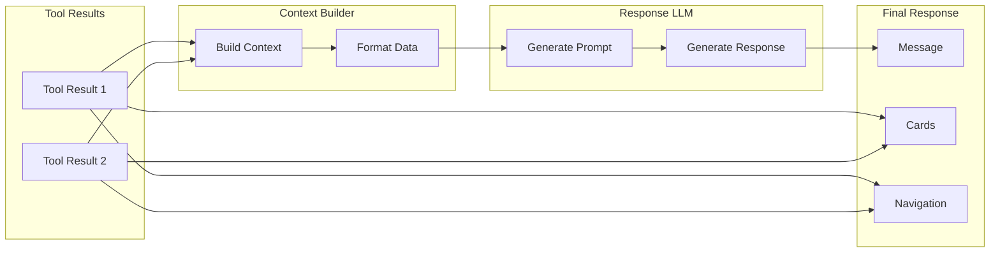

### 12.2 Synthesis Prompt Template

```typescript
const SYNTHESIS_PROMPT = `
You are an AI assistant for Saven InfraOps.

## Context
{conversation_history}

## User Question
{user_question}

## Tool Results
{tool_results_formatted}

## Task
Generate a natural language response that:
1. Answers the user's question directly
2. Incorporates data from the tool results
3. Is concise and helpful
4. Suggests relevant follow-up actions if appropriate

## Output Format
{
  "message": "Your response here...",
  "suggestions": ["Follow-up 1", "Follow-up 2"] (optional)
}

Do not mention tool names or technical details to the user.
`;
```

### 12.3 Example Synthesis

**Tool Results:**
```
IncidentTool: { count: 15, critical: 3 }
```

**Generated Response:**
```json
{
  "message": "There are 15 open incidents, including 3 critical (SEV1/SEV2) issues that need immediate attention.",
  "suggestions": [
    "Show critical incidents",
    "Navigate to incidents page"
  ]
}
```

---

## 13. Future Expansion

### 13.1 Extension Points

| Extension Point | Description | Example |
|-----------------|-------------|---------|
| **Database Tools** | Add new entity queries | `query_contracts` |
| **Custom Tools** | Business logic tools | `send_email`, `create_workflow` |
| **Navigation** | New page routes | `/ai-analytics` |
| **LLM Providers** | New AI providers | `Private Model` |
| **Middleware** | New checks | `Rate Limiter` |

### 13.2 Adding a New Database Tool

```typescript
// 1. Create tool definition
const query_contracts: Tool = {
  name: 'query_contracts',
  description: 'Query vendor contracts and agreements',
  category: 'database',
  requiredPermissions: ['contracts:view'],
  parameters: { /* schema */ },
  execute: async (params, context) => {
    // Implementation
  }
};

// 2. Register in registry
export const databaseTools = [
  // ... existing tools
  query_contracts
];

// 3. Update system prompt
const TOOL_DESCRIPTIONS = `
- query_contracts: Query vendor contracts...
`.trim();
```

### 13.3 Adding a Custom Tool

```typescript
// /tools/custom/sendEmail.ts

export const sendEmail: Tool = {
  name: 'send_email',
  description: 'Send an email notification to users',
  category: 'custom',
  requiredPermissions: ['notifications:send'],
  parameters: {
    type: 'object',
    properties: {
      recipients: { type: 'array', items: { type: 'string' } },
      subject: { type: 'string' },
      body: { type: 'string' }
    },
    required: ['recipients', 'body']
  },
  execute: async (params, context) => {
    // Integration with email service
  }
};
```

### 13.4 Planned Future Tools

| Tool | Category | Description |
|------|----------|-------------|
| `send_email` | custom | Send email notifications |
| `send_notification` | custom | Send in-app notifications |
| `create_workflow` | custom | Initiate approval workflows |
| `submit_approval` | custom | Approve/reject requests |
| `generate_report` | custom | Generate analytics reports |
| `query_sla` | database | Query SLA metrics |
| `query_metrics` | database | Query system metrics |

---

## 14. Folder Structure

```
backend/src/modules/ai/
│
├── agent/
│   │
│   ├── agent.ts                    # Main agent orchestrator
│   ├── types.ts                    # Shared type definitions
│   │
│   ├── routes/
│   │   └── agent.routes.ts         # Express route handlers
│   │
│   ├── core/
│   │   ├── intentClassifier.ts     # Intent classification
│   │   ├── toolSelector.ts         # Tool selection logic
│   │   ├── toolOrchestrator.ts      # Tool execution
│   │   ├── responseSynthesizer.ts  # Response generation
│   │   └── permissionGuard.ts       # Permission enforcement
│   │
│   ├── tools/
│   │   ├── registry.ts             # Tool registration
│   │   ├── types.ts               # Tool interfaces
│   │   │
│   │   ├── database/
│   │   │   ├── base.ts            # Base database tool
│   │   │   ├── userTool.ts
│   │   │   ├── incidentTool.ts
│   │   │   ├── ticketTool.ts
│   │   │   ├── assetTool.ts
│   │   │   ├── complianceTool.ts
│   │   │   ├── vendorTool.ts
│   │   │   ├── projectTool.ts
│   │   │   ├── accessTool.ts
│   │   │   ├── problemTool.ts
│   │   │   ├── changeTool.ts
│   │   │   ├── knowledgeTool.ts
│   │   │   ├── roleTool.ts
│   │   │   └── auditTool.ts
│   │   │
│   │   ├── navigation/
│   │   │   └── navigationTool.ts
│   │   │
│   │   ├── knowledge/
│   │   │   └── knowledgeTool.ts
│   │   │
│   │   └── custom/
│   │       ├── base.ts             # Base custom tool
│   │       ├── emailTool.ts        # (Future)
│   │       └── notificationTool.ts  # (Future)
│   │
│   ├── memory/
│   │   ├── memoryManager.ts       # Memory operations
│   │   ├── contextBuilder.ts      # Context building
│   │   └── summarizer.ts          # History summarization
│   │
│   ├── prompts/
│   │   ├── systemPrompt.ts        # System prompt template
│   │   ├── toolDescriptions.ts    # Tool descriptions
│   │   └── synthesisPrompt.ts      # Response synthesis
│   │
│   ├── errors/
│   │   ├── errorTypes.ts           # Error definitions
│   │   └── errorHandler.ts        # Error handling
│   │
│   └── config/
│       └── agentConfig.ts          # Agent configuration
│
├── providers/                     # Existing LLM providers
│   ├── providerFactory.ts
│   ├── openai.ts
│   ├── gemini.ts
│   └── claude.ts
│
├── legacy/
│   └── ai.service.ts              # Keep for compatibility
│
└── index.ts                       # Module exports
```

---

## 15. Implementation Phases

### Phase 1: Foundation (Week 1-2)

| Task | Description | Deliverables |
|------|-------------|--------------|
| Tool Interface | Define TypeScript interfaces | `Tool`, `ToolResult`, `ToolContext` |
| Tool Registry | Create registry structure | `registry.ts`, base implementation |
| Permission Guard | Implement permission checking | `permissionGuard.ts` |
| Basic Tool | Implement one database tool | `UserTool` as reference |
| Route Setup | Create new agent route | `/api/ai/agent/ask` |

### Phase 2: Core Tools (Week 3-4)

| Task | Description | Deliverables |
|------|-------------|--------------|
| Implement All DB Tools | All 13 database tools | Complete `database/` folder |
| Intent Classifier | Basic keyword + pattern | `intentClassifier.ts` |
| Tool Selector | Filter tools by intent | `toolSelector.ts` |
| Tool Orchestrator | Single & parallel execution | `toolOrchestrator.ts` |
| Memory Manager | Basic memory operations | `memoryManager.ts` |

### Phase 3: Intelligence (Week 5-6)

| Task | Description | Deliverables |
|------|-------------|--------------|
| LLM Classifier | Use LLM for intent | Enhanced classification |
| Response Synthesizer | Generate natural responses | `responseSynthesizer.ts` |
| Context Resolution | Resolve "it", "them", etc. | Entity tracking |
| Conversation Memory | Full history support | Pagination, summarization |

### Phase 4: Polish (Week 7-8)

| Task | Description | Deliverables |
|------|-------------|--------------|
| Navigation Tool | Full navigation support | `navigationTool.ts` |
| Error Handling | Graceful degradation | `errorHandler.ts` |
| Logging & Metrics | Full observability | Audit logging |
| Testing | Unit & integration tests | Test coverage |
| Documentation | API docs, user guide | Technical docs |

---

## 16. Risks

### 16.1 Risk Assessment Matrix

| Risk | Impact | Probability | Mitigation |
|------|--------|-------------|------------|
| **LLM Timeout** | High | Medium | Retry with backoff, fallback responses |
| **Permission Escalation** | Critical | Low | RBAC validation on every tool |
| **Data Leakage** | Critical | Low | Row-level security, query sanitization |
| **Tool Injection** | High | Medium | Parameter validation, schema enforcement |
| **Context Overflow** | Medium | Medium | Token budgeting, summarization |
| **LLM Hallucination** | Medium | Medium | Tool-based grounding, validation |

### 16.2 Security Considerations

| Concern | Solution |
|---------|----------|
| SQL Injection | Use Prisma parameterized queries |
| Permission Bypass | Double-check permissions before execution |
| Data Isolation | Row-level security per user |
| Prompt Injection | Sanitize user input |
| Token Theft | HTTPS only, secure storage |

---

## 17. Best Practices

### 17.1 Tool Design

1. **Single Responsibility** - Each tool does one thing well
2. **Clear Descriptions** - LLM must understand when to use
3. **Strict Parameters** - JSON Schema validation
4. **Error Handling** - Always return success/error
5. **Performance** - Index queries, pagination
6. **Security** - Permission checks on every execution

### 17.2 Intent Classification

1. **Fallback to LLM** - When patterns fail, use LLM
2. **Confidence Scores** - Return confidence for uncertain cases
3. **Entity Extraction** - Extract entities for context resolution
4. **History Awareness** - Consider conversation history

### 17.3 Response Generation

1. **Grounded Responses** - Base on tool results, not hallucination
2. **Actionable** - Suggest next steps
3. **Concise** - Don't overwhelm with data
4. **Professional** - Enterprise-appropriate tone

---

## 18. Final Recommendations

### 18.1 Architecture Decisions

| Decision | Recommendation | Rationale |
|----------|---------------|----------|
| **Tool Interface** | Standard JSON interface | Enables any tool to integrate |
| **Orchestration** | Agent decides execution order | Flexible for complex queries |
| **Memory** | Database-persisted | Enables multi-session context |
| **Permissions** | Pre-execution guard | Security first |
| **Response** | LLM synthesis | Natural language experience |

### 18.2 Success Metrics

| Metric | Target |
|--------|--------|
| Intent Accuracy | > 95% |
| Tool Selection Accuracy | > 90% |
| Response Quality (User Rating) | > 4/5 |
| Average Latency | < 2 seconds |
| Permission Errors | 0 false positives |

### 18.3 Future Considerations

1. **Streaming Responses** - SSE for real-time updates
2. **Voice Interface** - Speech-to-text integration
3. **Mobile Optimization** - Simplified responses
4. **Analytics Dashboard** - Usage metrics and trends
5. **A/B Testing** - Prompt optimization

### 18.4 Conclusion

This architecture provides a solid foundation for an enterprise AI Agent that:

- ✅ Understands user intent
- ✅ Executes secure database queries
- ✅ Maintains conversation context
- ✅ Enforces RBAC permissions
- ✅ Provides natural language responses
- ✅ Supports multi-tool orchestration
- ✅ Enables future extensibility

The design follows enterprise security principles while maintaining flexibility for future capabilities.

---

*End of Document*
