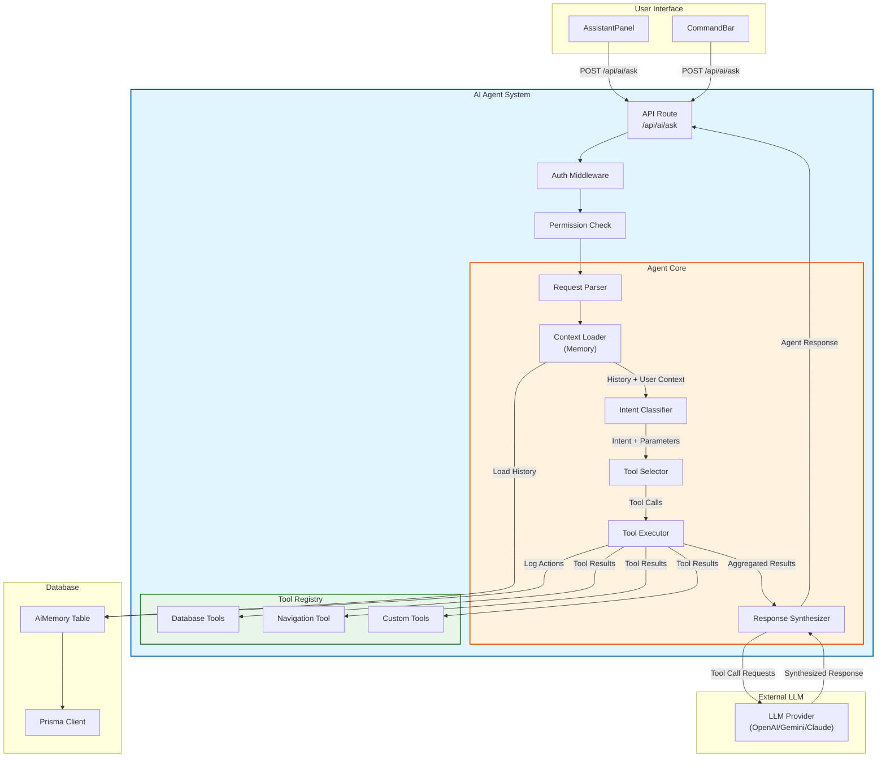
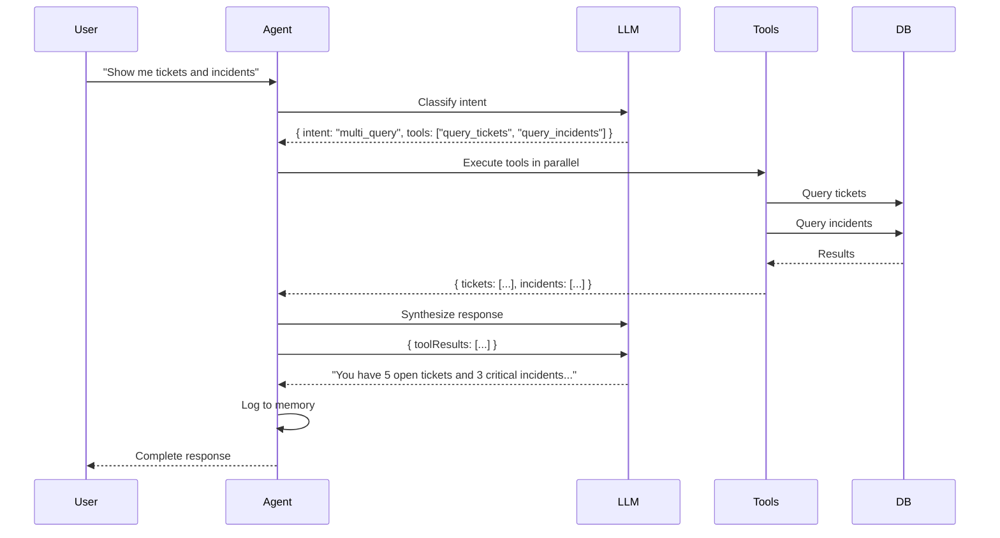
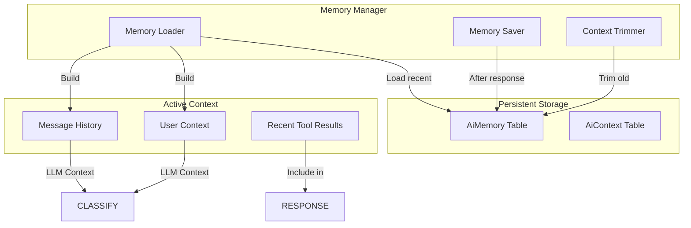

# AI Agent Design Document

**Document Version:** 1.0  
**Date:** 2026-06-24  
**Status:** DESIGN SPECIFICATION  
**Purpose:** Blueprint for implementing AI Agent architecture in Saven InfraOps Command Center

---

## Table of Contents

1. [Overview](#1-overview)
2. [Tool Registry](#2-tool-registry)
3. [Tool Interface Specification](#3-tool-interface-specification)
4. [JSON Schema for AI Output](#4-json-schema-for-ai-output)
5. [Multi-Tool Orchestration](#5-multi-tool-orchestration)
6. [Permission Enforcement](#6-permission-enforcement)
7. [Conversation Memory](#7-conversation-memory)
8. [Navigation Responses](#8-navigation-responses)
9. [Error Handling](#9-error-handling)
10. [Extensibility - Adding New Modules](#10-extensibility---adding-new-modules)
11. [Implementation Reference](#11-implementation-reference)

---

## 1. Overview

### 1.1 Design Goals

| Goal | Description |
|------|-------------|
| **Secure** | All tool access enforced via RBAC |
| **Extensible** | Easy to add new tools and modules |
| **Maintainable** | Clear interfaces and schemas |
| **Observable** | Full logging and tracing |
| **Resilient** | Graceful degradation on failures |

### 1.2 Architecture Overview



### 1.3 Request/Response Contract

**Request:**
```typescript
interface AgentRequest {
  question: string;           // User's natural language question
  conversationId?: string;     // Optional: for continuing conversations
  stream?: boolean;           // Optional: for streaming responses
}
```

**Response:**
```typescript
interface AgentResponse {
  message: string;            // Natural language response
  toolCalls?: ToolCall[];     // Tools that were invoked
  cards?: AiCard[];           // Structured data cards
  navigation?: Navigation;     // Navigation suggestions
  conversationId: string;      // For continuing conversation
  provider: string;           // LLM provider used
  model: string;              // LLM model used
  tokens?: TokenUsage;        // Usage statistics
}
```

---

## 2. Tool Registry

### 2.1 Core Database Tools

| Tool Name | Purpose | Entity |
|-----------|---------|--------|
| `query_tickets` | Query service requests | ServiceRequest |
| `query_incidents` | Query incidents | Incident |
| `query_problems` | Query problems | Problem |
| `query_changes` | Query change requests | ChangeRequest |
| `query_assets` | Query assets/inventory | Asset |
| `query_access_requests` | Query access requests | AccessRequest |
| `query_compliance` | Query compliance controls | ComplianceControl |
| `query_environments` | Query project environments | ProjectEnvironment |
| `query_licenses` | Query vendor licenses | VendorLicense |
| `query_knowledge` | Query knowledge base articles | KnowledgeBaseArticle |
| `query_users` | Query users | User |
| `query_roles` | Query roles and permissions | Role, Permission |
| `query_audit_logs` | Query audit history | AuditLog |

### 2.2 System Tools

| Tool Name | Purpose |
|-----------|---------|
| `navigate_to` | Generate navigation response |
| `get_user_context` | Get current user's permissions and info |
| `search_modules` | Search across all modules |

### 2.3 Tool Registry Structure

```typescript
// /backend/src/modules/ai/agent/tools/toolRegistry.ts

export interface Tool {
  name: string;
  description: string;
  parameters: ToolParameterSchema;
  execute: ToolExecutor;
  requiredPermissions?: string[];
  category: 'database' | 'system' | 'custom';
}

export interface ToolParameterSchema {
  type: 'object';
  properties: Record<string, ToolParameter>;
  required?: string[];
}

export interface ToolParameter {
  type: 'string' | 'number' | 'boolean' | 'array' | 'object';
  description: string;
  enum?: string[];
  default?: unknown;
}

export type ToolExecutor = (params: Record<string, unknown>, context: ToolContext) => Promise<ToolResult>;

export interface ToolContext {
  userId: string;
  userPermissions: string[];
  prisma: PrismaClient;
}

export interface ToolResult {
  success: boolean;
  data?: unknown;
  error?: string;
  cards?: AiCard[];
  navigation?: Navigation;
}
```

---

## 3. Tool Interface Specification

### 3.1 query_tickets

```typescript
const query_tickets: Tool = {
  name: 'query_tickets',
  description: 'Query service requests/tickets. Use this when user asks about tickets, service requests, or request status. Returns count and list of tickets matching criteria.',
  category: 'database',
  requiredPermissions: ['tickets:view'],
  parameters: {
    type: 'object',
    properties: {
      status: {
        type: 'array',
        description: 'Filter by status. Options: OPEN, ASSIGNED, IN_PROGRESS, WAITING_FOR_USER, WAITING_FOR_VENDOR, PENDING_APPROVAL, RESOLVED, CLOSED, REOPENED',
        items: { type: 'string' }
      },
      priority: {
        type: 'array',
        description: 'Filter by priority. Options: LOW, MEDIUM, HIGH, CRITICAL',
        items: { type: 'string' }
      },
      requesterId: {
        type: 'string',
        description: 'Filter by requester user ID'
      },
      assigneeId: {
        type: 'string',
        description: 'Filter by assignee user ID'
      },
      category: {
        type: 'string',
        description: 'Filter by category (partial match)'
      },
      includeBreached: {
        type: 'boolean',
        description: 'Include SLA breach information',
        default: false
      },
      limit: {
        type: 'number',
        description: 'Maximum number of results to return',
        default: 10,
        maximum: 100
      },
      orderBy: {
        type: 'string',
        description: 'Sort order. Options: createdAt, updatedAt, priority, dueAt',
        default: 'createdAt'
      },
      orderDirection: {
        type: 'string',
        description: 'Sort direction. Options: asc, desc',
        default: 'desc'
      }
    },
    required: []
  },
  execute: async (params, context) => {
    // Implementation
  }
};
```

**Example Usage:**
```
User: "Show me high priority tickets assigned to John"
AI Response: {
  toolCalls: [{
    tool: 'query_tickets',
    input: { priority: ['HIGH'], assigneeId: 'user-123' }
  }]
}
```

### 3.2 query_incidents

```typescript
const query_incidents: Tool = {
  name: 'query_incidents',
  description: 'Query IT incidents. Use when user asks about incidents, outages, or emergency issues. Returns count and list of incidents.',
  category: 'database',
  requiredPermissions: ['incidents:view'],
  parameters: {
    type: 'object',
    properties: {
      status: {
        type: 'array',
        description: 'Filter by status',
        items: { type: 'string' }
      },
      severity: {
        type: 'array',
        description: 'Filter by severity. Options: SEV1, SEV2, SEV3, SEV4',
        items: { type: 'string' }
      },
      impactedService: {
        type: 'string',
        description: 'Filter by impacted service name (partial match)'
      },
      ownerName: {
        type: 'string',
        description: 'Filter by owner name'
      },
      includeOpenDuration: {
        type: 'boolean',
        description: 'Calculate how long incidents have been open',
        default: false
      },
      limit: {
        type: 'number',
        description: 'Maximum results',
        default: 10,
        maximum: 100
      },
      orderBy: {
        type: 'string',
        default: 'createdAt'
      }
    },
    required: []
  }
};
```

### 3.3 query_assets

```typescript
const query_assets: Tool = {
  name: 'query_assets',
  description: 'Query IT assets and inventory. Use when user asks about laptops, hardware, equipment, or inventory status.',
  category: 'database',
  requiredPermissions: ['inventory:view'],
  parameters: {
    type: 'object',
    properties: {
      status: {
        type: 'array',
        description: 'Filter by asset status. Options: AVAILABLE, ASSIGNED, UNDER_REPAIR, DAMAGED, LOST, RETIRED, DISPOSED',
        items: { type: 'string' }
      },
      assetType: {
        type: 'string',
        description: 'Filter by asset type (e.g., Laptop, Server, Monitor)'
      },
      assignedToName: {
        type: 'string',
        description: 'Filter by assigned person name'
      },
      location: {
        type: 'string',
        description: 'Filter by location (partial match)'
      },
      includeWarrantyStatus: {
        type: 'boolean',
        description: 'Include warranty expiration status',
        default: false
      },
      limit: {
        type: 'number',
        default: 20,
        maximum: 100
      }
    },
    required: []
  }
};
```

### 3.4 query_compliance

```typescript
const query_compliance: Tool = {
  name: 'query_compliance',
  description: 'Query compliance controls and audit items. Use when user asks about compliance, audits, controls, or regulatory requirements.',
  category: 'database',
  requiredPermissions: ['compliance:view'],
  parameters: {
    type: 'object',
    properties: {
      status: {
        type: 'array',
        description: 'Filter by compliance status',
        items: { type: 'string' }
      },
      riskRating: {
        type: 'array',
        description: 'Filter by risk rating. Options: LOW, MEDIUM, HIGH, CRITICAL',
        items: { type: 'string' }
      },
      controlArea: {
        type: 'string',
        description: 'Filter by control area (partial match)'
      },
      ownerName: {
        type: 'string',
        description: 'Filter by owner'
      },
      dueWithinDays: {
        type: 'number',
        description: 'Filter controls due within N days'
      },
      overdue: {
        type: 'boolean',
        description: 'Filter only overdue controls',
        default: false
      },
      includeEvidenceStatus: {
        type: 'boolean',
        description: 'Include evidence upload status',
        default: false
      },
      limit: {
        type: 'number',
        default: 20
      }
    },
    required: []
  }
};
```

### 3.5 query_users

```typescript
const query_users: Tool = {
  name: 'query_users',
  description: 'Query user accounts. Use when user asks about team members, user information, or personnel.',
  category: 'database',
  requiredPermissions: ['users:view'],
  parameters: {
    type: 'object',
    properties: {
      status: {
        type: 'array',
        description: 'Filter by user status. Options: PENDING_ACTIVATION, ACTIVE, DISABLED, LOCKED',
        items: { type: 'string' }
      },
      department: {
        type: 'string',
        description: 'Filter by department'
      },
      roleId: {
        type: 'string',
        description: 'Filter by role ID'
      },
      search: {
        type: 'string',
        description: 'Search by name or email (partial match)'
      },
      includeRoles: {
        type: 'boolean',
        description: 'Include user roles in response',
        default: false
      },
      limit: {
        type: 'number',
        default: 20
      }
    },
    required: []
  }
};
```

### 3.6 query_roles

```typescript
const query_roles: Tool = {
  name: 'query_roles',
  description: 'Query roles and their permissions. Use when user asks about role definitions, permissions, or access levels.',
  category: 'database',
  requiredPermissions: ['roles:view'],
  parameters: {
    type: 'object',
    properties: {
      roleId: {
        type: 'string',
        description: 'Get specific role by ID'
      },
      roleName: {
        type: 'string',
        description: 'Get specific role by name'
      },
      includePermissions: {
        type: 'boolean',
        description: 'Include permission details',
        default: true
      },
      includeUserCount: {
        type: 'boolean',
        description: 'Include count of users in each role',
        default: false
      }
    },
    required: []
  }
};
```

### 3.7 navigate_to

```typescript
const navigate_to: Tool = {
  name: 'navigate_to',
  description: 'Generate a navigation response to take user to a specific page. Use when user wants to go to a page or needs a direct link.',
  category: 'system',
  requiredPermissions: [],
  parameters: {
    type: 'object',
    properties: {
      route: {
        type: 'string',
        description: 'Target route. Options: dashboard, service-requests, incidents, problems, changes, inventory, access-management, compliance, projects-environments, vendors-licenses, reports-analytics, knowledge-base, users-teams, roles-permissions, settings',
        enum: [
          '/',
          '/service-requests',
          '/incidents',
          '/problems',
          '/changes',
          '/inventory',
          '/access-management',
          '/compliance',
          '/projects-environments',
          '/vendors-licenses',
          '/reports-analytics',
          '/knowledge-base',
          '/users-teams',
          '/roles-permissions',
          '/settings'
        ]
      },
      label: {
        type: 'string',
        description: 'Human-readable label for the navigation'
      },
      context: {
        type: 'object',
        description: 'Optional context to pass (e.g., filtered view parameters)',
        properties: {
          filter?: Record<string, unknown>;
          selectedId?: string;
          tab?: string;
        }
      }
    },
    required: ['route']
  }
};
```

### 3.8 get_user_context

```typescript
const get_user_context: Tool = {
  name: 'get_user_context',
  description: 'Get information about the current user including their permissions, roles, and department. Use to personalize responses based on user context.',
  category: 'system',
  requiredPermissions: [],
  parameters: {
    type: 'object',
    properties: {
      includePermissions: {
        type: 'boolean',
        description: 'Include full permission list',
        default: true
      },
      includeRoles: {
        type: 'boolean',
        description: 'Include role details',
        default: true
      }
    },
    required: []
  }
};
```

### 3.9 search_modules

```typescript
const query_access_requests: Tool = {
  name: 'query_access_requests',
  description: 'Query access/identity requests. Use when user asks about access requests, provisioning, or identity management.',
  category: 'database',
  requiredPermissions: ['access:view'],
  parameters: {
    type: 'object',
    properties: {
      status: {
        type: 'array',
        description: 'Filter by status. Options: REQUESTED, APPROVED, REJECTED, PROVISIONED, REVOKED, EXPIRED',
        items: { type: 'string' }
      },
      requesterName: {
        type: 'string',
        description: 'Filter by requester name'
      },
      systemName: {
        type: 'string',
        description: 'Filter by target system'
      },
      accessType: {
        type: 'string',
        description: 'Filter by access type'
      },
      pendingApproval: {
        type: 'boolean',
        description: 'Filter only items pending my approval',
        default: false
      },
      limit: {
        type: 'number',
        default: 20
      }
    },
    required: []
  }
};
```

---

## 4. JSON Schema for AI Output

### 4.1 Tool Call Schema

The AI should output tool calls in this JSON format:

```typescript
// JSON Schema for AI Tool Call Output
const toolCallSchema = {
  type: 'object',
  properties: {
    tool_calls: {
      type: 'array',
      description: 'Array of tool calls to execute',
      items: {
        type: 'object',
        properties: {
          tool: {
            type: 'string',
            description: 'Name of the tool to call',
            enum: [
              'query_tickets',
              'query_incidents', 
              'query_problems',
              'query_changes',
              'query_assets',
              'query_access_requests',
              'query_compliance',
              'query_environments',
              'query_licenses',
              'query_knowledge',
              'query_users',
              'query_roles',
              'query_audit_logs',
              'navigate_to',
              'get_user_context',
              'search_modules'
            ]
          },
          input: {
            type: 'object',
            description: 'Parameters for the tool',
            additionalProperties: true
          },
          reasoning: {
            type: 'string',
            description: 'Optional explanation of why this tool was selected'
          }
        },
        required: ['tool', 'input']
      }
    },
    message: {
      type: 'string',
      description: 'Natural language message to display while/after tools execute'
    }
  },
  required: ['tool_calls']
};

// Example AI Output
const aiOutput = {
  tool_calls: [
    {
      tool: 'query_tickets',
      input: {
        status: ['OPEN', 'IN_PROGRESS'],
        priority: ['HIGH', 'CRITICAL'],
        limit: 10,
        includeBreached: true
      },
      reasoning: 'User asked about critical tickets, filtering for high priority and open status'
    }
  ],
  message: 'Let me check for critical open tickets...'
};
```

### 4.2 Complete Response Schema

```typescript
const completeResponseSchema = {
  type: 'object',
  properties: {
    message: {
      type: 'string',
      description: 'Final natural language response'
    },
    tool_calls: {
      type: 'array',
      items: {
        type: 'object',
        properties: {
          tool: { type: 'string' },
          input: { type: 'object' },
          result: {
            type: 'object',
            properties: {
              success: { type: 'boolean' },
              data: { type: 'array' },
              count: { type: 'number' },
              cards: { type: 'array' },
              navigation: {
                type: 'object',
                properties: {
                  route: { type: 'string' },
                  label: { type: 'string' },
                  context: { type: 'object' }
                }
              }
            }
          },
          error: { type: 'string' }
        }
      }
    },
    cards: {
      type: 'array',
      items: {
        type: 'object',
        properties: {
          title: { type: 'string' },
          value: { type: 'string' },
          description: { type: 'string' },
          href: { type: 'string' }
        }
      }
    },
    navigation: {
      type: 'object',
      properties: {
        route: { type: 'string' },
        label: { type: 'string' },
        context: { type: 'object' }
      }
    },
    suggestions: {
      type: 'array',
      items: { type: 'string' },
      description: 'Follow-up questions the user might ask'
    },
    metadata: {
      type: 'object',
      properties: {
        conversationId: { type: 'string' },
        provider: { type: 'string' },
        model: { type: 'string' },
        tokens: {
          type: 'object',
          properties: {
            prompt: { type: 'number' },
            completion: { type: 'number' },
            total: { type: 'number' }
          }
        },
        latencyMs: { type: 'number' }
      }
    }
  },
  required: ['message', 'metadata']
};
```

### 4.3 System Prompt for Tool Use

```typescript
const AGENT_SYSTEM_PROMPT = `You are an AI assistant for Saven InfraOps Command Center, an enterprise ITSM platform.

## Your Capabilities

You have access to the following tools to help users:

### Database Query Tools
- **query_tickets**: Query service requests/tickets. Use for ticket counts, lists, filtering by status/priority.
- **query_incidents**: Query IT incidents and outages. Use for incident counts, severity filtering.
- **query_problems**: Query known problems and root causes.
- **query_changes**: Query change requests and approvals.
- **query_assets**: Query IT inventory and assets (laptops, servers, equipment).
- **query_access_requests**: Query access/identity provisioning requests.
- **query_compliance**: Query compliance controls, audits, and regulatory items.
- **query_environments**: Query project environments and infrastructure.
- **query_licenses**: Query vendor licenses and renewals.
- **query_knowledge**: Query knowledge base articles.
- **query_users**: Query user accounts and team members.
- **query_roles**: Query roles and their permissions.
- **query_audit_logs**: Query audit trail and change history.

### System Tools
- **navigate_to**: Generate navigation to a specific page. Use when user wants to go somewhere.
- **get_user_context**: Get current user's permissions and info for personalization.
- **search_modules**: Search across all modules.

## How to Use Tools

When a user asks a question:

1. **Determine intent**: What information does the user need?
2. **Select tools**: Choose the appropriate tools to get that information.
3. **Build parameters**: Specify exact filters, limits, etc.
4. **Output JSON**: Return a JSON object with tool_calls array.

## Output Format

Always respond with a JSON object containing:
{
  "tool_calls": [
    {
      "tool": "tool_name",
      "input": { /* parameters */ },
      "reasoning": "why I chose this tool"
    }
  ],
  "message": "What you're doing while tools execute"
}

## Permission Rules

- You CANNOT execute tools the user doesn't have permission for
- Check user's permissions before selecting tools
- If user lacks permission, explain why and suggest alternatives

## Error Handling

- If a tool fails, try an alternative approach
- If no tools can help, provide a helpful response without tools
- Never pretend a tool succeeded if it failed

## Examples

User: "How many open tickets do we have?"
{
  "tool_calls": [
    {
      "tool": "query_tickets",
      "input": { "status": ["OPEN", "ASSIGNED", "IN_PROGRESS"], "limit": 1 },
      "reasoning": "Count open tickets by querying with limit=1 and getting count"
    }
  ],
  "message": "Let me check for open tickets..."
}

User: "Show me critical incidents"
{
  "tool_calls": [
    {
      "tool": "query_incidents", 
      "input": { "severity": ["SEV1", "SEV2"], "status": ["OPEN", "IN_PROGRESS"] },
      "reasoning": "Filter for critical severity and open status"
    }
  ],
  "message": "Finding critical incidents..."
}

User: "Take me to the inventory page"
{
  "tool_calls": [
    {
      "tool": "navigate_to",
      "input": { "route": "/inventory", "label": "Inventory" },
      "reasoning": "User wants navigation to inventory page"
    }
  ],
  "message": "Navigating to inventory..."
}

## Guidelines

- Be concise and helpful
- Use tools when they add value, not for every question
- For general knowledge, you can answer without tools
- Always consider user permissions
- Format numbers and dates clearly
- Suggest relevant follow-up actions

Current date: ${new Date().toISOString().split('T')[0]}`;
```

---

## 5. Multi-Tool Orchestration

### 5.1 Orchestration Flow



### 5.2 Tool Execution Strategy

```typescript
// /backend/src/modules/ai/agent/orchestrator.ts

interface ExecutionStrategy {
  type: 'sequential' | 'parallel' | 'conditional';
  tools: ToolExecution[];
}

type ToolExecution = {
  tool: string;
  params: Record<string, unknown>;
  dependsOn?: string[];  // Tool names this depends on
};

class ToolOrchestrator {
  
  /**
   * Execute multiple tools with appropriate strategy
   */
  async executeTools(
    executions: ToolExecution[],
    context: ToolContext
  ): Promise<AggregatedResults> {
    
    // 1. Build dependency graph
    const graph = this.buildDependencyGraph(executions);
    
    // 2. Identify parallelizable tools (no dependencies)
    const parallelGroups = this.identifyParallelGroups(graph);
    
    // 3. Execute in groups
    const results: Map<string, ToolResult> = new Map();
    
    for (const group of parallelGroups) {
      // Execute all tools in this group in parallel
      const groupResults = await Promise.all(
        group.map(exec => this.executeSingleTool(exec, context))
      );
      
      // Store results
      group.forEach((exec, index) => {
        results.set(exec.tool, groupResults[index]);
      });
      
      // Check for failures that block dependent tools
      const failures = this.identifyBlockingFailures(group, groupResults);
      if (failures.length > 0) {
        // Stop execution if critical failures
        break;
      }
    }
    
    // 4. Aggregate results
    return this.aggregateResults(results);
  }
  
  /**
   * Example: Multi-query orchestration
   */
  async handleMultiQuery(question: string, context: ToolContext) {
    // User asked: "Show me tickets and incidents"
    
    const executions: ToolExecution[] = [
      { tool: 'query_tickets', params: { status: ['OPEN'] } },
      { tool: 'query_incidents', params: { status: ['OPEN'] } }
    ];
    
    // Both have no dependencies - execute in parallel
    return this.executeTools(executions, context);
  }
}
```

### 5.3 Result Aggregation

```typescript
interface AggregatedResults {
  toolResults: ToolResult[];
  cards: AiCard[];
  navigation?: Navigation;
  summary: {
    totalResults: number;
    successfulTools: string[];
    failedTools: string[];
  };
}

class ResultAggregator {
  
  aggregate(results: Map<string, ToolResult>): AggregatedResults {
    const cards: AiCard[] = [];
    let navigation: Navigation | undefined;
    
    for (const [toolName, result] of results) {
      if (result.success) {
        // Collect cards from database tools
        if (result.cards) {
          cards.push(...result.cards);
        }
        
        // Take first navigation result
        if (result.navigation && !navigation) {
          navigation = result.navigation;
        }
      }
    }
    
    return {
      toolResults: Array.from(results.values()),
      cards,
      navigation,
      summary: {
        totalResults: cards.length,
        successfulTools: this.getSuccessfulTools(results),
        failedTools: this.getFailedTools(results)
      }
    };
  }
}
```

### 5.4 Cross-Tool Example

**Scenario:** User asks "Show me tickets from the Network team and any related incidents"

```typescript
// Step 1: First get users in Network team
{
  tool_calls: [
    {
      tool: 'query_users',
      input: { department: 'Network', includeRoles: false },
      reasoning: 'First find Network team members'
    }
  ]
}

// Step 2: Then query tickets for those users (depends on step 1)
{
  tool_calls: [
    {
      tool: 'query_tickets',
      input: { 
        requesterId: '{{previous_result.user_ids}}',
        includeBreached: true 
      },
      reasoning: 'Query tickets for Network team members',
      dependsOn: ['query_users']
    }
  ]
}
```

---

## 6. Permission Enforcement

### 6.1 Permission Model

```typescript
// /backend/src/modules/ai/agent/permissionGuard.ts

interface PermissionContext {
  userId: string;
  userPermissions: string[];
  userRoles: string[];
}

/**
 * Check if user has permission to execute a tool
 */
function canExecuteTool(
  tool: Tool,
  context: PermissionContext
): { allowed: boolean; reason?: string } {
  
  // System tools with no permission requirements
  if (!tool.requiredPermissions || tool.requiredPermissions.length === 0) {
    return { allowed: true };
  }
  
  // Check each required permission
  for (const required of tool.requiredPermissions) {
    if (!context.userPermissions.includes(required)) {
      return {
        allowed: false,
        reason: `Missing required permission: ${required}`
      };
    }
  }
  
  return { allowed: true };
}

/**
 * Filter tool selection based on permissions
 */
function filterToolsByPermission(
  tools: Tool[],
  context: PermissionContext
): Tool[] {
  return tools.filter(tool => canExecuteTool(tool, context).allowed);
}
```

### 6.2 Tool Selection with Permissions

```typescript
// When LLM proposes tools, filter by permissions before executing

class PermissionFilteredSelector {
  
  async selectAndFilterTools(
    proposedTools: string[],
    allTools: Tool[],
    context: PermissionContext
  ): Promise<{ allowed: string[]; denied: string[] }> {
    
    const allowed: string[] = [];
    const denied: string[] = [];
    
    for (const toolName of proposedTools) {
      const tool = allTools.find(t => t.name === toolName);
      
      if (!tool) {
        denied.push(toolName);
        continue;
      }
      
      const result = canExecuteTool(tool, context);
      if (result.allowed) {
        allowed.push(toolName);
      } else {
        denied.push(toolName);
        // Log denied access attempt
        console.warn(`[AI Agent] Permission denied for ${toolName}: ${result.reason}`);
      }
    }
    
    return { allowed, denied };
  }
}
```

### 6.3 Permission-Aware LLM Prompting

```typescript
// Include user's permissions in context for LLM

function buildContextWithPermissions(
  question: string,
  conversationHistory: Message[],
  userContext: PermissionContext
): string {
  
  const availableTools = filterToolsByPermission(ALL_TOOLS, userContext);
  
  return `
User Question: ${question}

User Permissions: ${userContext.userPermissions.join(', ') || 'None'}

Available Tools (you can only use these):
${availableTools.map(t => `- ${t.name}: ${t.description}`).join('\n')}

${conversationHistory.length > 0 ? `
Conversation History:
${conversationHistory.map(m => `${m.role}: ${m.content}`).join('\n')}
` : ''}

Respond with tool calls for available tools only.
`;
}
```

### 6.4 Row-Level Security

```typescript
// Some queries should be filtered based on user's data access

class RowLevelSecurity {
  
  applyDataFilters(
    tool: Tool,
    params: Record<string, unknown>,
    context: PermissionContext
  ): Record<string, unknown> {
    
    // Example: If user can only see their own tickets
    if (tool.name === 'query_tickets' && !context.userPermissions.includes('tickets:view_all')) {
      return {
        ...params,
        requesterId: context.userId  // Force filter to own tickets
      };
    }
    
    // Example: Manager can see their team's tickets
    if (tool.name === 'query_tickets' && context.userPermissions.includes('tickets:view_team')) {
      const teamMemberIds = await this.getTeamMembers(context.userId);
      return {
        ...params,
        requesterId: { in: teamMemberIds }
      };
    }
    
    return params;
  }
}
```

### 6.5 Permission Error Response

```typescript
// When a tool is denied due to permissions

interface PermissionDeniedResult {
  success: false;
  error: 'PERMISSION_DENIED';
  tool: string;
  requiredPermission: string;
  userMessage: string;  // Safe message for user
}

function createPermissionDeniedResult(
  tool: Tool,
  requiredPermission: string
): PermissionDeniedResult {
  return {
    success: false,
    error: 'PERMISSION_DENIED',
    tool: tool.name,
    requiredPermission,
    userMessage: `You don't have permission to access ${tool.description}. Please contact your administrator to request the "${requiredPermission}" permission.`
  };
}
```

---

## 7. Conversation Memory

### 7.1 Memory Architecture



### 7.2 Database Schema

```prisma
// AiMemory - Stores individual messages/events
model AiMemory {
  id             String   @id @default(cuid())
  conversationId String   @index
  userId         String   @index
  role           String   // 'user' | 'assistant' | 'tool'
  content        String   @db.Text
  toolName       String?  // If role = 'tool'
  toolInput      Json?    // Tool parameters
  toolOutput     Json?    // Tool result (summarized)
  tokens         Int?     // Approximate token count
  createdAt      DateTime @default(now())
}

// AiContext - Stores conversation metadata
model AiContext {
  id             String   @id @default(cuid())
  conversationId String   @unique
  userId         String   @index
  title          String?  // Auto-generated or user-provided
  messageCount   Int      @default(0)
  lastMessageAt  DateTime @default(now())
  lastToolAt    DateTime?
  metadata       Json?    // Tags, flags, etc.
  createdAt      DateTime @default(now())
  updatedAt      DateTime @updatedAt
}
```

### 7.3 Memory Manager Implementation

```typescript
// /backend/src/modules/ai/agent/memory/memoryManager.ts

interface MemoryOptions {
  maxMessages: number;        // Max messages to keep in context
  maxTokens: number;         // Max tokens in context window
  summarizeAfter: number;    // Summarize after N messages
}

const DEFAULT_MEMORY_OPTIONS: MemoryOptions = {
  maxMessages: 50,
  maxTokens: 8000,
  summarizeAfter: 20
};

class MemoryManager {
  
  constructor(
    private prisma: PrismaClient,
    private options: MemoryOptions = DEFAULT_MEMORY_OPTIONS
  ) {}
  
  /**
   * Load conversation history for context
   */
  async loadHistory(
    conversationId: string,
    options?: Partial<MemoryOptions>
  ): Promise<ConversationContext> {
    const opts = { ...this.options, ...options };
    
    // Load recent messages
    const messages = await this.prisma.aiMemory.findMany({
      where: { conversationId },
      orderBy: { createdAt: 'desc' },
      take: opts.maxMessages
    });
    
    // Reverse to get chronological order
    const chronological = messages.reverse();
    
    // Build context
    const userMessages = chronological.filter(m => m.role === 'user');
    const assistantMessages = chronological.filter(m => m.role === 'assistant');
    const toolMessages = chronological.filter(m => m.role === 'tool');
    
    // Check if summarization needed
    const totalTokens = this.estimateTokens(chronological);
    
    if (totalTokens > opts.maxTokens && userMessages.length > opts.summarizeAfter) {
      // Summarize older messages
      const summary = await this.summarizeOlderMessages(
        chronological.slice(0, -opts.summarizeAfter)
      );
      
      return {
        messages: [
          ...summary,
          ...chronological.slice(-opts.summarizeAfter)
        ],
        hasSummary: true
      };
    }
    
    return {
      messages: chronological,
      hasSummary: false
    };
  }
  
  /**
   * Save new exchange to memory
   */
  async saveExchange(
    conversationId: string,
    userId: string,
    exchange: {
      userMessage: string;
      assistantMessage: string;
      toolCalls?: ToolCall[];
      toolResults?: ToolResult[];
    }
  ): Promise<void> {
    
    // Save user message
    await this.prisma.aiMemory.create({
      data: {
        conversationId,
        userId,
        role: 'user',
        content: exchange.userMessage,
        tokens: this.estimateTokens(exchange.userMessage)
      }
    });
    
    // Save assistant message
    await this.prisma.aiMemory.create({
      data: {
        conversationId,
        userId,
        role: 'assistant',
        content: exchange.assistantMessage,
        tokens: this.estimateTokens(exchange.assistantMessage)
      }
    });
    
    // Save tool calls if any
    if (exchange.toolCalls) {
      for (const call of exchange.toolCalls) {
        await this.prisma.aiMemory.create({
          data: {
            conversationId,
            userId,
            role: 'tool',
            content: JSON.stringify(call),
            toolName: call.tool,
            toolInput: call.input as any,
            toolOutput: this.summarizeToolResult(call.result) as any,
            tokens: this.estimateTokens(JSON.stringify(call))
          }
        });
      }
    }
    
    // Update conversation context
    await this.prisma.aiContext.update({
      where: { conversationId },
      data: {
        messageCount: { increment: 2 },
        lastMessageAt: new Date(),
        lastToolAt: exchange.toolCalls ? new Date() : undefined
      }
    });
    
    // Check if trimming needed
    await this.trimIfNeeded(conversationId);
  }
  
  /**
   * Create new conversation
   */
  async createConversation(
    userId: string,
    title?: string
  ): Promise<string> {
    const conversationId = generateId();
    
    await this.prisma.aiContext.create({
      data: {
        conversationId,
        userId,
        title: title || `Conversation ${new Date().toLocaleDateString()}`
      }
    });
    
    return conversationId;
  }
  
  /**
   * Trim old messages if over limit
   */
  private async trimIfNeeded(conversationId: string): Promise<void> {
    const count = await this.prisma.aiMemory.count({
      where: { conversationId }
    });
    
    if (count > this.options.maxMessages * 2) {
      // Delete oldest messages
      const toDelete = await this.prisma.aiMemory.findMany({
        where: { conversationId },
        orderBy: { createdAt: 'asc' },
        take: count - this.options.maxMessages,
        select: { id: true }
      });
      
      await this.prisma.aiMemory.deleteMany({
        where: {
          id: { in: toDelete.map(m => m.id) }
        }
      });
    }
  }
}
```

### 7.4 Context Window Management

```typescript
interface ConversationContext {
  messages: AiMessage[];
  hasSummary: boolean;
}

interface AiMessage {
  role: 'system' | 'user' | 'assistant' | 'tool';
  content: string;
  toolCall?: {
    name: string;
    input: Record<string, unknown>;
    result?: unknown;
  };
}

/**
 * Build context string for LLM
 */
function buildContextString(
  context: ConversationContext,
  systemPrompt: string
): string {
  const parts: string[] = [systemPrompt];
  
  if (context.hasSummary) {
    parts.push('[Earlier conversation summarized above]');
  }
  
  for (const msg of context.messages) {
    if (msg.role === 'system') {
      parts.push(`System: ${msg.content}`);
    } else if (msg.role === 'user') {
      parts.push(`User: ${msg.content}`);
    } else if (msg.role === 'assistant') {
      parts.push(`Assistant: ${msg.content}`);
    } else if (msg.role === 'tool') {
      const result = msg.toolCall?.result;
      const summary = typeof result === 'object' 
        ? JSON.stringify(result).slice(0, 500) 
        : String(result);
      parts.push(`[Tool: ${msg.toolCall?.name}] Result: ${summary}`);
    }
  }
  
  return parts.join('\n\n');
}
```

---

## 8. Navigation Responses

### 8.1 Navigation Types

```typescript
// /backend/src/modules/ai/agent/tools/navigation.ts

interface Navigation {
  type: 'route' | 'modal' | 'drawer' | 'action';
  route?: string;
  label: string;
  description?: string;
  context?: NavigationContext;
}

interface NavigationContext {
  // For filtered views
  filters?: Record<string, unknown>;
  // For opening specific records
  selectedId?: string;
  // For tabs
  tab?: string;
  // For modals
  modalAction?: 'create' | 'edit' | 'view';
}

type NavigationResponse = {
  navigate: Navigation;
  message: string;
};
```

### 8.2 Navigation Tool Definition

```typescript
const navigate_to: Tool = {
  name: 'navigate_to',
  description: 'Generate a navigation response to take user to a specific page or open a specific record.',
  category: 'system',
  requiredPermissions: [],
  parameters: {
    type: 'object',
    properties: {
      route: {
        type: 'string',
        description: 'Target route',
        enum: [
          'dashboard',
          'service-requests',
          'incidents',
          'problems',
          'changes',
          'inventory',
          'access-management',
          'compliance',
          'projects-environments',
          'vendors-licenses',
          'reports-analytics',
          'knowledge-base',
          'users-teams',
          'roles-permissions',
          'settings'
        ]
      },
      label: {
        type: 'string',
        description: 'Human-readable label for the navigation'
      },
      description: {
        type: 'string',
        description: 'Brief description of where this navigates'
      },
      context: {
        type: 'object',
        description: 'Navigation context',
        properties: {
          filters: {
            type: 'object',
            description: 'URL filters to apply'
          },
          selectedId: {
            type: 'string',
            description: 'ID of record to select/highlight'
          },
          tab: {
            type: 'string',
            description: 'Tab to open'
          },
          modalAction: {
            type: 'string',
            enum: ['create', 'edit', 'view'],
            description: 'Action to perform on arrival'
          }
        }
      }
    },
    required: ['route']
  }
};
```

### 8.3 Frontend Navigation Response Handling

```typescript
// /frontend/src/components/AssistantPanel.tsx

interface NavigationResponse {
  navigation: {
    route: string;
    label: string;
    description?: string;
    context?: {
      filters?: Record<string, string>;
      selectedId?: string;
      tab?: string;
      modalAction?: 'create' | 'edit' | 'view';
    };
  };
}

// In AssistantPanel
function handleNavigation(navigation: NavigationResponse) {
  const { route, label, context } = navigation.navigation;
  
  // Build URL with query params
  let url = route;
  if (context?.filters) {
    const params = new URLSearchParams(context.filters);
    url += `?${params.toString()}`;
  }
  
  // Navigate
  navigate(url);
  
  // Handle modal actions
  if (context?.modalAction) {
    setTimeout(() => {
      if (context.modalAction === 'create') {
        openCreateModal();
      } else if (context.modalAction === 'edit' && context.selectedId) {
        openEditModal(context.selectedId);
      } else if (context.selectedId) {
        openViewDrawer(context.selectedId);
      }
    }, 100);  // Small delay to allow page load
  }
  
  // Handle record selection
  if (context?.selectedId && !context.modalAction) {
    setTimeout(() => {
      selectRecord(context.selectedId!);
    }, 200);
  }
}
```

### 8.4 Navigation Examples

```typescript
// Example 1: Simple navigation
{
  tool_calls: [{
    tool: 'navigate_to',
    input: {
      route: 'service-requests',
      label: 'View Service Requests',
      description: 'Go to the Service Requests page'
    }
  }]
}

// Example 2: Navigation with filters
{
  tool_calls: [{
    tool: 'navigate_to',
    input: {
      route: 'incidents',
      label: 'View Critical Incidents',
      context: {
        filters: {
          severity: 'SEV1,SEV2',
          status: 'OPEN'
        }
      }
    }
  }]
}

// Example 3: Open specific record
{
  tool_calls: [{
    tool: 'query_tickets',
    input: { limit: 1 }
  }],
  message: 'Found your ticket. Let me open it.',
  navigation: {
    route: 'service-requests',
    label: 'SR-00001',
    context: {
      selectedId: 'ticket-123',
      modalAction: 'view'
    }
  }
}
```

---

## 9. Error Handling

### 9.1 Error Types

```typescript
// /backend/src/modules/ai/agent/errors.ts

enum ErrorCode {
  // Authentication/Authorization
  AUTHENTICATION_REQUIRED = 'AUTHENTICATION_REQUIRED',
  PERMISSION_DENIED = 'PERMISSION_DENIED',
  
  // Tool Execution
  TOOL_NOT_FOUND = 'TOOL_NOT_FOUND',
  TOOL_EXECUTION_FAILED = 'TOOL_EXECUTION_FAILED',
  TOOL_VALIDATION_FAILED = 'TOOL_VALIDATION_FAILED',
  TOOL_TIMEOUT = 'TOOL_TIMEOUT',
  
  // LLM
  LLM_UNAVAILABLE = 'LLM_UNAVAILABLE',
  LLM_RATE_LIMITED = 'LLM_RATE_LIMITED',
  LLM_RESPONSE_INVALID = 'LLM_RESPONSE_INVALID',
  
  // Memory
  MEMORY_LOAD_FAILED = 'MEMORY_LOAD_FAILED',
  MEMORY_SAVE_FAILED = 'MEMORY_SAVE_FAILED',
  
  // General
  INTERNAL_ERROR = 'INTERNAL_ERROR',
  INVALID_REQUEST = 'INVALID_REQUEST'
}

interface AgentError {
  code: ErrorCode;
  message: string;
  details?: Record<string, unknown>;
  recoverable: boolean;
  userMessage: string;
}
```

### 9.2 Error Handler Implementation

```typescript
// /backend/src/modules/ai/agent/errors/errorHandler.ts

class AgentErrorHandler {
  
  handle(error: unknown): AgentError {
    if (error instanceof AuthenticationError) {
      return {
        code: ErrorCode.AUTHENTICATION_REQUIRED,
        message: 'Authentication required',
        recoverable: false,
        userMessage: 'Please log in to use the AI assistant.'
      };
    }
    
    if (error instanceof PermissionDeniedError) {
      return {
        code: ErrorCode.PERMISSION_DENIED,
        message: `Missing permission: ${error.permission}`,
        details: { requiredPermission: error.permission },
        recoverable: false,
        userMessage: `You don't have permission to perform this action. Please contact your administrator.`
      };
    }
    
    if (error instanceof ToolNotFoundError) {
      return {
        code: ErrorCode.TOOL_NOT_FOUND,
        message: `Tool not found: ${error.toolName}`,
        details: { toolName: error.toolName },
        recoverable: true,
        userMessage: `I couldn't complete that request. Let me try a different approach.`
      };
    }
    
    if (error instanceof ToolExecutionError) {
      return {
        code: ErrorCode.TOOL_EXECUTION_FAILED,
        message: error.message,
        details: { toolName: error.toolName, originalError: error.cause },
        recoverable: error.retryable,
        userMessage: this.getUserMessageForToolError(error)
      };
    }
    
    if (error instanceof LLMError) {
      return this.handleLLMError(error);
    }
    
    // Unknown error
    return {
      code: ErrorCode.INTERNAL_ERROR,
      message: error instanceof Error ? error.message : 'Unknown error',
      recoverable: false,
      userMessage: 'An unexpected error occurred. Please try again.'
    };
  }
  
  private handleLLMError(error: LLMError): AgentError {
    if (error.statusCode === 401) {
      return {
        code: ErrorCode.AUTHENTICATION_REQUIRED,
        message: 'LLM API authentication failed',
        recoverable: false,
        userMessage: 'AI service configuration error. Please contact support.'
      };
    }
    
    if (error.statusCode === 429) {
      return {
        code: ErrorCode.LLM_RATE_LIMITED,
        message: 'Rate limit exceeded',
        recoverable: true,
        userMessage: 'AI service is busy. Please wait a moment and try again.'
      };
    }
    
    if (error.statusCode === 503) {
      return {
        code: ErrorCode.LLM_UNAVAILABLE,
        message: 'LLM service unavailable',
        recoverable: true,
        userMessage: 'AI service is temporarily unavailable. Please try again later.'
      };
    }
    
    return {
      code: ErrorCode.LLM_UNAVAILABLE,
      message: error.message,
      recoverable: true,
      userMessage: 'AI service error. Please try again.'
    };
  }
  
  private getUserMessageForToolError(error: ToolExecutionError): string {
    if (error.toolName === 'query_tickets') {
      return 'I had trouble loading tickets. Please check if the database is accessible.';
    }
    if (error.toolName === 'query_incidents') {
      return 'I had trouble loading incidents. Please check if the database is accessible.';
    }
    return 'I had trouble completing that request. Please try again.';
  }
}
```

### 9.3 Retry Strategy

```typescript
// /backend/src/modules/ai/agent/retry/retryStrategy.ts

interface RetryConfig {
  maxRetries: number;
  initialDelayMs: number;
  maxDelayMs: number;
  backoffMultiplier: number;
}

const DEFAULT_RETRY_CONFIG: RetryConfig = {
  maxRetries: 3,
  initialDelayMs: 1000,
  maxDelayMs: 10000,
  backoffMultiplier: 2
};

async function withRetry<T>(
  fn: () => Promise<T>,
  config: Partial<RetryConfig> = {}
): Promise<T> {
  const cfg = { ...DEFAULT_RETRY_CONFIG, ...config };
  let lastError: Error;
  
  for (let attempt = 0; attempt <= cfg.maxRetries; attempt++) {
    try {
      return await fn();
    } catch (error) {
      lastError = error instanceof Error ? error : new Error(String(error));
      
      if (attempt === cfg.maxRetries) {
        throw lastError;
      }
      
      // Only retry recoverable errors
      if (!isRecoverableError(error)) {
        throw lastError;
      }
      
      // Calculate delay with exponential backoff
      const delay = Math.min(
        cfg.initialDelayMs * Math.pow(cfg.backoffMultiplier, attempt),
        cfg.maxDelayMs
      );
      
      await sleep(delay);
    }
  }
  
  throw lastError!;
}

function isRecoverableError(error: unknown): boolean {
  if (error instanceof ToolTimeoutError) return true;
  if (error instanceof LLMError && error.retryable) return true;
  if (error instanceof NetworkError) return true;
  return false;
}
```

### 9.4 Graceful Degradation

```typescript
// /backend/src/modules/ai/agent/fallback/fallbackHandler.ts

class FallbackHandler {
  
  /**
   * When primary tools fail, try alternatives
   */
  async withFallback(
    primaryFn: () => Promise<ToolResult>,
    fallbackFn: () => Promise<ToolResult>
  ): Promise<ToolResult> {
    try {
      return await primaryFn();
    } catch (primaryError) {
      console.warn('[AI Agent] Primary tool failed, trying fallback:', primaryError);
      
      try {
        return await withRetry(fallbackFn);
      } catch (fallbackError) {
        // Both failed
        console.error('[AI Agent] Both primary and fallback failed');
        return {
          success: false,
          error: `Primary failed: ${primaryError.message}; Fallback failed: ${fallbackError.message}`
        };
      }
    }
  }
  
  /**
   * Fallback for LLM unavailable
   */
  async withMockFallback(
    question: string,
    context: ToolContext
  ): Promise<string> {
    // Return helpful canned responses based on keywords
    const q = question.toLowerCase();
    
    if (q.includes('ticket') || q.includes('service request')) {
      return 'The AI service is temporarily unavailable. For ticket information, please visit the Service Requests page directly.';
    }
    
    if (q.includes('incident')) {
      return 'The AI service is temporarily unavailable. For incident information, please visit the Incidents page directly.';
    }
    
    if (q.includes('compliance') || q.includes('audit')) {
      return 'The AI service is temporarily unavailable. For compliance information, please visit the Compliance page directly.';
    }
    
    return 'The AI assistant is temporarily unavailable. Please try again in a few minutes.';
  }
}
```

---

## 10. Extensibility - Adding New Modules

### 10.1 Adding a New Database Tool

**Step 1: Create the tool file**

```typescript
// /backend/src/modules/ai/agent/tools/database/query_<new_entity>.ts

import { Tool, ToolExecutor, ToolContext, ToolResult } from '../types';
import { Prisma } from '@prisma/client';

export const query_newEntity: Tool = {
  name: 'query_new_entity',
  description: 'Query new entity items. Use when user asks about...',
  category: 'database',
  requiredPermissions: ['new_entity:view'],
  parameters: {
    type: 'object',
    properties: {
      status: {
        type: 'array',
        description: 'Filter by status',
        items: { type: 'string' }
      },
      // Add more filters...
      limit: {
        type: 'number',
        default: 20,
        maximum: 100
      }
    },
    required: []
  },
  execute: async (params, context): Promise<ToolResult> => {
    try {
      const where: Prisma.NewEntityWhereInput = {};
      
      // Apply filters
      if (params.status) {
        where.status = { in: params.status };
      }
      
      // Query database
      const items = await context.prisma.newEntity.findMany({
        where,
        orderBy: { createdAt: 'desc' },
        take: params.limit as number || 20
      });
      
      // Transform to cards
      const cards = items.map(item => ({
        title: item.referenceField,  // e.g., item.code
        value: item.status,
        description: item.title,
        href: '/new-entity-page'
      }));
      
      return {
        success: true,
        data: items,
        count: items.length,
        cards
      };
    } catch (error) {
      return {
        success: false,
        error: error instanceof Error ? error.message : 'Query failed'
      };
    }
  }
};
```

**Step 2: Register in tool registry**

```typescript
// /backend/src/modules/ai/agent/tools/toolRegistry.ts

import { query_newEntity } from './database/query_<new_entity>';

export const databaseTools: Tool[] = [
  query_tickets,
  query_incidents,
  // ... existing tools
  query_newEntity  // Add new tool
];

export const allTools: Tool[] = [
  ...databaseTools,
  ...systemTools
];
```

**Step 3: Add to system prompt**

```typescript
// /backend/src/modules/ai/agent/prompts/toolDescriptions.ts

export const TOOL_DESCRIPTIONS = `
- **query_new_entity**: Query new entity items. Use when user asks about...
`.trim();
```

### 10.2 Adding a Custom Tool

```typescript
// /backend/src/modules/ai/agent/tools/custom/sendNotification.ts

export const sendNotification: Tool = {
  name: 'send_notification',
  description: 'Send a notification to users. Use when user wants to notify team members.',
  category: 'custom',
  requiredPermissions: ['notifications:send'],
  parameters: {
    type: 'object',
    properties: {
      recipients: {
        type: 'array',
        description: 'User IDs or emails of recipients',
        items: { type: 'string' }
      },
      subject: {
        type: 'string',
        description: 'Notification subject'
      },
      message: {
        type: 'string',
        description: 'Notification message body'
      },
      channel: {
        type: 'string',
        description: 'Channel: email, in_app, or both',
        enum: ['email', 'in_app', 'both'],
        default: 'in_app'
      }
    },
    required: ['recipients', 'message']
  },
  execute: async (params, context): Promise<ToolResult> => {
    const { recipients, subject, message, channel } = params;
    
    try {
      // Send notifications
      await notificationService.send({
        to: recipients,
        subject: subject || 'Notification from AI Assistant',
        body: message,
        channel: channel || 'in_app'
      });
      
      return {
        success: true,
        data: { sent: recipients.length }
      };
    } catch (error) {
      return {
        success: false,
        error: `Failed to send notification: ${error.message}`
      };
    }
  }
};
```

### 10.3 Adding a New Route/Page

When adding a new page, update the navigation tool:

```typescript
// /backend/src/modules/ai/agent/tools/system/navigation.ts

const navigate_to: Tool = {
  // ...
  parameters: {
    properties: {
      route: {
        enum: [
          // ... existing routes
          '/new-page',  // Add new route
        ]
      }
    }
  }
};
```

### 10.4 Module Extension Checklist

When adding a new business module:

- [ ] Create Prisma model (if new entity)
- [ ] Create query tool in `/tools/database/`
- [ ] Register tool in `toolRegistry.ts`
- [ ] Add permission to `Permission` table
- [ ] Update tool descriptions in system prompt
- [ ] Update `navigate_to` tool if page navigation needed
- [ ] Add route to frontend `App.tsx`
- [ ] Add sidebar item in `Sidebar.tsx`
- [ ] Create page component
- [ ] Add tests for new tool
- [ ] Update documentation

---

## 11. Implementation Reference

### 11.1 File Structure

```
backend/src/modules/ai/
├── agent/
│   ├── agent.ts                    # Main orchestrator
│   ├── types.ts                    # Shared types
│   │
│   ├── routes/
│   │   └── agent.routes.ts         # Express routes
│   │
│   ├── tools/
│   │   ├── toolRegistry.ts         # Tool registration
│   │   ├── types.ts                # Tool interfaces
│   │   │
│   │   ├── database/
│   │   │   ├── query_tickets.ts
│   │   │   ├── query_incidents.ts
│   │   │   ├── query_assets.ts
│   │   │   ├── query_compliance.ts
│   │   │   ├── query_users.ts
│   │   │   ├── query_roles.ts
│   │   │   ├── query_problems.ts
│   │   │   ├── query_changes.ts
│   │   │   ├── query_access_requests.ts
│   │   │   ├── query_environments.ts
│   │   │   ├── query_licenses.ts
│   │   │   ├── query_knowledge.ts
│   │   │   └── query_audit_logs.ts
│   │   │
│   │   ├── system/
│   │   │   ├── navigate_to.ts
│   │   │   └── get_user_context.ts
│   │   │
│   │   └── custom/
│   │       └── send_notification.ts
│   │
│   ├── memory/
│   │   ├── memoryManager.ts
│   │   └── contextBuilder.ts
│   │
│   ├── prompts/
│   │   ├── systemPrompt.ts
│   │   └── toolDescriptions.ts
│   │
│   ├── orchestrator/
│   │   ├── toolOrchestrator.ts
│   │   └── resultAggregator.ts
│   │
│   ├── errors/
│   │   ├── errorHandler.ts
│   │   └── errors.ts
│   │
│   └── permissions/
│       └── permissionGuard.ts
│
├── providers/                     # Existing LLM providers
│   ├── providerFactory.ts
│   ├── openai.ts
│   ├── gemini.ts
│   └── claude.ts
│
└── ai.service.ts                  # Legacy service (keep for compatibility)
```

### 11.2 Key Interfaces Summary

```typescript
// Core Types
interface Tool {
  name: string;
  description: string;
  parameters: ToolParameterSchema;
  execute: ToolExecutor;
  requiredPermissions?: string[];
  category: 'database' | 'system' | 'custom';
}

interface ToolExecutor {
  (params: Record<string, unknown>, context: ToolContext): Promise<ToolResult>;
}

interface ToolResult {
  success: boolean;
  data?: unknown;
  error?: string;
  cards?: AiCard[];
  navigation?: Navigation;
}

interface ToolContext {
  userId: string;
  userPermissions: string[];
  prisma: PrismaClient;
}

interface AgentRequest {
  question: string;
  conversationId?: string;
  stream?: boolean;
}

interface AgentResponse {
  message: string;
  toolCalls?: ToolCall[];
  cards?: AiCard[];
  navigation?: Navigation;
  conversationId: string;
  provider: string;
  model: string;
  tokens?: TokenUsage;
}
```

### 11.3 Configuration

```typescript
// /backend/src/config/agent.ts

export const agentConfig = {
  // Memory
  maxConversationMessages: 50,
  maxContextTokens: 8000,
  summarizeAfterMessages: 20,
  
  // Execution
  maxConcurrentTools: 5,
  toolTimeoutMs: 30000,
  maxRetries: 3,
  
  // LLM
  defaultProvider: 'openai',
  fallbackProviders: ['gemini', 'claude'],
  
  // Safety
  maxToolCallsPerRequest: 10,
  enablePermissionFiltering: true,
  enableRowLevelSecurity: true,
  
  // Logging
  logToolCalls: true,
  logLLMPrompts: false,
  logErrors: true
};
```

---

*End of Design Document*
